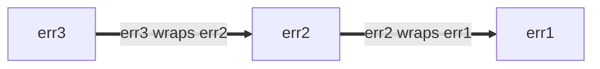

[TOC]

# 腾讯 Go 语言编程指南

《腾讯 Go 语言编程指南》是 腾讯 代码委员会 Go 分会在 Code Review 总结的编程实践集合。本指南从 Go (Go 1.18以后版本) 的语言特性出发，基于公司 [Go 语言代码规范](https://git.woa.com/standards/go)，同时结合日常工作中碰到的实际问题，展示了在 Go 编程中常见的问题和**推荐**方案。希望本手册能够帮助你写出更易读、更健壮和性能更好的 Go 语言代码。
本指南在以下几位主体贡献者之上修改：jessemjchen(陈明杰);joekuang(邝细超);amdahliu(刘曾好);ethanwan(万刚辉);wineguo(郭琪周)
，在此基础上招募成员重新制定


| 成员          | 贡献          |
|-------------|-------------|
| jessemjchen | 项目主导和review |
| joekuang    | 主体框架        |
| ethanwan    | 方法章节        |
| admdahliu   | 最佳实践        |
| wineguo     | 接口章节        |
| jianjunli   | -           |
| nickzydeng  | -           |
| michaelbi   | -           |
| yousali   | -           |
| kacychen   | -           |
| yorkershi   | -           |
| jianfengye   | -           |
| yongbohe   | -           |
| jetxiao   | -           |
| csuzhang   | -           |


## 基本原则

基本原则包含一些 Go 代码编写的总体原则，总结了如何编写可读性强的 Go 代码。以下是指导编写可读性代码的一些重要原则，按重要性排列如下：

1. 逻辑清晰
2. 简单
3. 简洁
4. 可维护性

### 逻辑清晰

代码可读性的核心目标是编写易于读者理解的代码。我们可以通过准确的命名、有用的注释和合理的代码组织结构这三个手段来使我们的代码清晰易懂。

### 简单

简单是指用最简单的代码实现目标功能，尽量做到逻辑复杂程度最低，运行性能最高。这并不意味着复杂的代码不能或不应该用 Go 编写，或者 Go 代码不允许写得复杂。我们努力使代码避免不必要复杂性，这样当复杂性确实出现时，就表明相关代码需要小心理解和维护。而如果代码实现的功能很简单，但是代码逻辑却异常复杂，这通常说明代码陷入了不必要的复杂性。

#### 最少依赖原则

尽量使用 Go 标准库能力，避免引入第三方库或者使用自己编写的工具库。具体来说：

1. 最先考虑直接使用基础结构体，例如管道，切片，映射等
2. 如果无法满足，则应该考虑使用标准库中的工具库，例如 `http` 库
3. 最后，应该确认社区没有相关满足能力的库之后，才考虑自己编写相关工具库

### 简洁

简洁是指代码实现逻辑清晰，不包含与功能无关的或不必要的代码。以下是影响代码简洁性的一些最常见的场景：

- 重复代码
- 多余的代码
- 晦涩难懂的命名
- 过度抽象
- 多余的空行

而这些场景中，重复代码的危害是最大的。维护代码的人要非常小心，才能准确无误地修改变更逻辑，保证不出现漏改或者错改。

此外，尽量遵循 Go 的习惯用法对于保持代码的简洁也非常有用。例如，在错误处理场景，我们应该尽量使用 `err != nil` 的用法。

```go
// Good
if err := doSomething(); err != nil {
    // ...
}

// Bad
if err := doSomething(); err == nil {
    // ...
}
```

### 可维护性

一个功能上线后，往往会被多次修改优化。因而，可维护性就变得很重要了，否则修改重构代码将困难重重。可维护性强的代码具有如下特点：

- 拥有组织结构化的 API ，未来可以轻松地进行扩充和修改
- 关注代码要解决的功能问题，而不是过度关注代码的组织结构
- 避免不必要的代码耦合，不为未使用的功能编写代码
- 测试用例完备，以确保功能被破坏时，能通过测试用例失败及时发现
- 避免在容易忽略的地方隐藏细节，降低改错的风险

```go
// Bad
// The use of = instead of := can change this line completely.
if user, err = db.UserByID(userID); err != nil {
    // ...
}
```

以下代码中，单个字符的存在与否对于逻辑准确性至关重要，但又非常容易写错。
将其分拆成布尔变量，然后再组合判断能有效降低理解难度，提高代码的可维护性。

```go

// Bad
// The ! in the middle of this line is very easy to miss.
leap := (year%4 == 0) && (!(year%100 == 0) || (year%400 == 0))
// Good
// Gregorian leap years aren't just year%4 == 0.
// See https://en.wikipedia.org/wiki/Leap_year#Algorithm.
var (
    leap4   = year%4 == 0
    leap100 = year%100 == 0
    leap400 = year%400 == 0
)
leap := leap4 && (!leap100 || leap400)
```

以下是一个过度关注代码组织结构的示例。假设我们需要编写一个程序来处理用户信息，处理逻辑比较简单，那么就没有必要进行过多分包，可以直接在一个包中完成所有与用户处理相关的代码。这种简洁的设计使得代码更容易理解，更专注于解决实际问题。

```text
// Bad
user/
  ├── model/
  │   ├── user.go
  ├── api/
  │   ├── user_api.go
  ├── service/
  │   ├── user_service.go
  ├── repository/
  │   ├── user_repository.go
  ├── utils/
  │   ├── user_utils.go

// Good
user/
  ├── user.go
  ├── api.go 
  ├── service.go 
  ├── repository.go 
  ├── utils.go 
```


### 一致性

一致性是指在多个代码库中、在团队或包的上下文中、甚至在一个文件中，代码逻辑风格尽量保持一致或者近似一致。包内的一致性通常是最直接重要的一致性。如果在一个包中以多种方式解决同一问题，或者同一概念在一个文件中具有多个名称，就会显得非常不优雅。而如果一致性与代码规范冲突时（例如，团队早期一直使用驼峰命名法命名代码文件，代码规范要求使用小写+下划线命名），那么我们应该以代码规范为准，将旧的不符合规范的代码逐步迁移统一到规范标准。

以下是一个几何计算逻辑示例，在计算面积时我们使用成员函数实现，那么计算周长时也应该尽量考虑使用成员函数实现。

```go
type Rectangle struct {
    width  float64
    height float64
}

func (r Rectangle) Area() float64 {
    return r.width * r.height
}

// Good
func (r Rectangle) Perimeter() float64 {
    return 2 * (r.width + r.height)
}

// Bad
func CalculatePerimeter(rectangle Rectangle) float64 {
    return 2 * (rectangle.width + rectangle.height)
}
```

## 命名

命名的首要要求是符合代码规范，在此基础上，我们对各类场景有如下推荐做法。

### 包名

导入包示例如下：
```go
import (
    "time"
    "net/url"

    httpurl "example.com/http/url" // 别名引用
)
```
一个好的包名可以让每个使用者都用相同的名称引用其内容，这对协同开发很有帮助。推荐包名应该：

- 简短、简洁、唯一，包名应该含义明确具有高区分性，例如：`http`，`list`。不要使用 `common`，`util` 等通用名称。
- 全部小写，不需要下划线、混合大写字母，无需驼峰命名，例如：`math`，`time`。不要使用 `user_count`，`userCount`。
- 单数，不用复数，例如：`usercount`，不要使用 `usercounts`。
- 可以使用惯用名称缩写，例如：`rand`，`io`，`cmp`，`fmt`，`strconv`，`syscall`。
- 注意可读性、易用性，避免歧义，例如，使用 `usercount` 通常比 `count` 更适合做包名，因为 `count` 是一个惯用名称，无法准确表达功能含义。
- 可使用别名，包名只是导入时的默认名称，它不需要在所有源代码中都是唯一的。在极少数发生冲突的情况下（无冲突不应使用别名），我们可以将导入包重命名。
- 包名与目录名一致，通常我们会将代码所在目录名作为包名使用
`src/encoding/base64` 中的包作为 `encoding/base64` 导入，但名称为 `base64` ，而不是 `encoding_base64` ，`encodingBase64` 。
- 使用包名引用内容，代码包导入后，为避免内容重复，使用包名来引用其内容。（尽量不要使用 `import .` 表示法，它可以简化测试场景的外部引用，但是也可能会导致不必要的混淆，无法清晰区分包内外。）

例如：`bufio` 包中的缓冲读取器类型称为 `Reader` ，而不是 `BufReader` ，因为用户将其视为 `bufio.Reader`，这是一个清晰、简洁的名称。此外，由于用包名区分了寻址关系，因此 `bufio.Reader` 不会与 `io.Reader` 出现引用冲突。

类似地，创建 `ring.Ring` 新实例的函数（即构造函数）通常被称为 `NewRing` ，但由于 `Ring` 是包导出的唯一类型，并且由于包名是 `ring` ，所以我们可以将构造函数名命名为 `New` ，包的客户端使用时是 `ring.New`，简洁而易懂。

另一个短命名的例子是 `once.Do`，`Once.Do(setup)` 可读性很好，而改成 `Once.DoOrWaitUntilDone(setup)` 也没有更易懂。长命名并不一定会增加可读性，如果有必要，我们可以增加实用易懂的文档注释，这样会比冗长的名称更有帮助。

### 接口名

- 单方法接口名称加上 -er 后缀或类似修饰来构造接口名称。
例如：`Reader` 、 `Writer` 、 `Formatter` 、 `CloseNotifier` 等。
这样的名称有很多，尊重它们以及基于它们而命名的函数名称是很有成效的。

- 接口名称不要带有众所周知规范含义的命名方法。
例如 `Read` 、 `Write` 、 `Close` 、 `Flush` 、 `String` 等都有规范的命名方式和含义。 为了避免混淆，请不要随意对自己实现的接口使用这些名称，除非它具有相同的签名和含义。

- 如果你的类型实现的方法与众所周知的类型上的方法具有相同含义，请为它指定相同的名称和签名，从而保证相同签名实现相同的语义。例如，调用字符串转换器方法应该命名为 `String` 而不是 `ToString` 。

### 接收器名

接收器变量名应该满足如下要求：

- 极短，一般是1~2个字母
- 类型本身的缩写
- 对于每个类型，其接收器的名称应始终保持一致。

以下是代码示例：

```go
type Calculator struct{

}

// Good
// Use a single letter receiver name
func(c *Calculator) Add(a,b int) int {
  // xxxxx
}
func(c *Calculator) Sub(a,b int) int {
  // xxxxx
}

// Bad
// Use a long receiver name like 'cal' or 'calculator', and use different names for different methods
func(cal *Calculator) Add(a,b int) int {
  // xxxxx
}
func(calculator *Calculator) Sub(a,b int) int {
  // xxxxx
}
```

### 取值器名

取值（Getters）场景不应使用 Get 或 get 前缀，除非底层概念使用了“get”这个词（例如 HTTP GET），建议直接使用以名词开头的名称，例如使用 `Counts` 而不是 `GetCounts`。

以下是代码示例：

```go
type Counter struct {
    counts int
}

func (c *Counter) Increment() {
    c.counts++
}
// Good
func (c *Counter) Counts() int {
    return c.counts
}
// Bad
func (c *Counter) GetCounts() int {
    return c.counts
}
```

如果需要， `setter` 函数可以定义为 `SetXXX` 。 比如 `SetOwner`。这个名字在实践中读起来很符合直觉：

```go
// Good
owner := obj.Owner()
if owner != user {
    obj.SetOwner(user)
}
```

### 变量名

#### 作用域与长度成正比

变量名的长度应该与其作用域的大小成正比，与其在作用域内的使用次数成反比。

单个代码文件作用域的变量可能需要几个单词，但是一个逻辑代码块的作用域内的变量可能只需要一个单词，甚至一两个字母。

作用域大小的通常判断方式如下：

- 小作用域是指执行一两个小操作的作用域，通常约1-7行。
- 中等作用域是指执行几个小操作或一个大操作的作用域，通常约8-15行。
- 大作用域是指执行一个或几个大操作的作用域，通常约15-25行。
- 非常大的作用域是指跨越一个以上页面的作用域（一般超过25行）。

而如果在作用域中，有许多表示类似的值或概念的变量，那就可能需要比作用域建议的更长的变量名，以达到强可读性。

概念的具体性也可以帮助保持变量名的简洁。例如，一个短的变量名如db，原本保留给非常小的作用域，但假设项目只有一个数据库在使用，虽然作用域非常大，也可能保持完美的清晰度。在这种情况下，基于作用域的大小，单词 database 可能是可以接受的，但由于 db 是单词的非常常见的缩写，几乎没有其他解释，因此 db 也是可以接受的。

#### 惯用法

局部变量的名称应反映其包含的内容及其在当前上下文中的用途，而不是值的来源。

通常情况下，最佳局部变量名并不会与结构体或协议缓冲区字段名相同。

此外，我们还有如下建议用法：

- 通常用单词命名（如 `count` 或 `options` ）是一个不错的选择。
- 如有必要，可以添加额外的单词来消除类似名称的歧义，例如 `userCount` 和 `projectCount` 。
- 不要为了节省输入而简单地删除字母。例如， `Sandbox` 优于 `Sbx` ，尤其是对于导出的名称。
- 从大多数变量名中省略类型和类似类型的单词。例如尽量使用 `user` 而不是 `userString` 。
- 对于统计场景， `userCount` 比 `numUsers` 或 `usersInt` 更好。
- 对于切片场景， `users` 比 `userSlice` 更好。对于映射场景，如果上下文清晰，我们同样可以使用 `users` 表示是用户集合。对于复杂场景，可以用类似于 `usersByID` 以清晰表明键值对。
- 如果作用域中有一个对象的两个类型的值，可以使用包含类似类型的限定词。例如，可以将输入值存储在 `ageString` 中，并使用 `age` 表示解析后的数值。
- 省略来自上下文的信息。例如，在实现 `UserCount` 方法中，名为 `userCount` 的局部变量可能是多余的， `count` 、 `users` 或甚至 `c` 的可读性都一样。
- 单字母变量名 单字母变量名可以是一种有用的工具，可以最小化重复，但也可能使代码不必要地难以理解。将它们的使用限制在完整单词明显且在单字母变量的地方出现会重复的情况下。

#### 单字母命名

单字母命名在某些情况下能够减少代码重复，但过度使用可能会导致代码变得可读性极差。在作用域较小或者变量用途非常明确情况下，可以使用单字母变量名，复杂代码场景仍然需要更具有描述性的变量名。
我们有如下建议用法：

- 接收器名建议使用1~2个字母
- 常见类型，使用对应的单字母通常可读性也是很强的，例如： r 用于 `io.Reader` 或 `*http.Request` ，坐标用 x 和 y 表示。
- 短作用域，使用缩写作为变量名，例如 `for _, n := range nodes { ... }`。

### 减少重复

命名过程中，要注意减少重复，包括名称重复、重复上下文已经隐含的概念内容等。

#### 包名与导出标识符

可导出标识符（函数、变量和常量等）在被使用时会关联上包名，因此可以减少两者之间的冗余信息。以下是一些命名示例：

- `db.NewDB() -> db.New()`
- `charcounter.CountChar() --> charcounter.Count()`

#### 方法名与接收器

方法名不要与方法接收器名字重复。

```go
// Good:
func (c *Config) WriteTo(w io.Writer) (int64, error)

// Bad:
func (c *Config) WriteConfigTo(w io.Writer) (int64, error)
```

#### 方法/函数名与参数

方法/函数名不要与其参数名重复。

```go
// Good:
func Override(dest, source *Config) error

// Bad:
func OverrideFirstWithSecond(dest, source *Config) error
```

#### 方法/函数名与返回值

方法/函数名不要与其返回值重复。

```go
// Good:
func Transform(input *Config) *jsonconfig.Config

// Bad:
func TransformYAMLToJSON(input *Config) *jsonconfig.Config
```

#### 变量名与类型

在大多数情况下，通过变量的使用方式，读者也能清楚地知道变量的类型。以下是一些命名示例：

- `var numUsers int` -> `var userCount int`
- `var userSlice []*User` -> `var users []*User`
- `var primaryProject *Project` -> `var primary *Project`

只有在同一作用域中出现一个对象的两个值类型时，才需要通过变量类型命名来特意说明变量的类型:

```go
// Good:
limitStr := r.FormValue("limit")
limit, err := strconv.Atoi(limitStr)
// Bad:
limitRaw := r.FormValue("limit")
limit, err := strconv.Atoi(limitRaw)
```

### 命名约定

在为函数和方法选择名称时，还有一些常见的约定：

- 返回结果的函数应该使用名词命名。

```go
// Good:
func (c *Config) JobName(key string) (string, bool)
```

- 执行某些操作的函数应该使用动词命名。

```go
// Good:
func (c *Config) WriteDetail(w io.Writer) (int64, error)
```

类似功能的函数，如果只有返回结果类型不同，应在函数名称的末尾包含类型名称。

```go
// Good:
func ParseInt(input string) (int, error)
func ParseInt64(input string) (int64, error)
func AppendInt(buf []byte, value int) []byte
func AppendInt64(buf []byte, value int64) []byte
```

如果有一个明确的“主要”版本，则可以省略主要版本的的类型名称：

```go
// Good:
func (c *Config) Marshal() ([]byte, error)
func (c *Config) MarshalText() (string, error)
```

### 工具包

Go 语言的包名可以在包声明中指定，与代码路径分开。
包名的可读性比代码路径更重要。

Go 包的名称应与包所提供的内容相关。
命名一个包为 `util` 、 `helper` 、 `common` 或类似的名称通常是一个不好的选择（虽然可以将其作为名称的一部分使用）。
不具有信息量的名称会使代码更难以阅读，如果过于广泛使用，可能会导致不必要的导入冲突。

相反，可以考虑一下调用函数的代码场景。

```go
// Good:
db := spannertest.NewDatabaseFromFile(...)

_, err := f.Seek(0, io.SeekStart)

b := elliptic.Marshal(curve, x, y)
```

即使不知道导入列表（ `cloud.google.com/go/spanner/spannertest` 、`io` 和 `crypto/elliptic` ），你也可以大致了解每个函数的作用。
如果包名名称不够具体，可能会出现以下可读性很差的情况：

```go
// Bad:
db := test.NewDatabaseFromFile(...)

_, err := f.Seek(0, common.SeekStart)

b := helper.Marshal(curve, x, y)
```

## 注释

注释的惯用法通常是为了让阅读注释的人有更好的阅读体验，易于理解注释所表达的内容。
Go 提供了 C 风格的 `/* */` 块注释和 C++ 风格的 `//` 行注释。
行注释是最常用的，块注释主要是使用在包注释场景，但也常用于复杂语句说明或用于代码禁用（不推荐使用块注释来禁用代码，不需要使用的代码建议直接删除，后续如果需要重新使用可以通过代码版本管理工具恢复）。

### 格式规范

注释列宽应该与代码列宽保持一致，尽量使注释在120列宽以内。不管涉及到的标识符是否可导出，应该使用相同的注释风格。此外，注释也应该遵从标准的英语语法：首字母大写，规范使用标点符号等

### 命名返回结果

裸返回仅在小函数中可接受。一旦函数变成中等大小，需要考虑明确返回值。同样，不要仅因为函数较长较复杂而命名结果参数，函数签名是否足够清晰明确才是我们最终的考量。在下述示例中，我们使用 `CancelFunc func` ，而不是 `func()` 往往能更清晰表明返回结果的含义。

```go
// Good:
// WithTimeout returns a context that will be canceled no later than d duration
// from now.
//
// The caller must arrange for the returned cancel function to be called when
// the context is no longer needed to prevent a resource leak.
func WithTimeout(parent Context, d time.Duration) (ctx Context, cancel func())
```


## 文档

### 约定

以易于理解的方式记录的 Go 代码比那些错误记录或根本没有记录的代码更容易阅读，且更不容易被误用。可运行的示例会显示在 Godoc 和代码搜索中，是解释如何使用代码的绝佳方式。

#### 参数和配置

不是每个参数都必须在文档中列举出来。
这适用于：

- 函数和方法参数
- 结构体字段
- 选项的 API

将易出错或不明显的字段和参数记录下来，说说它们为什么需要被关注。

在下面的片段中，突出显示的注释对读者来说没有增加什么有用的信息：

```go
// Bad:
// Sprintf formats according to a format specifier and returns the resulting
// string.
//
// format is the format, and data is the interpolation data.
func Sprintf(format string, data ...interface{}) string
```

然而，这个片段展示了一个与之前类似的代码场景，其中注释反而说明了一些不明显或对读者有实质性帮助的东西：

```go
// Good:
// Sprintf formats according to a format specifier and returns the resulting
// string.
//
// The provided data is used to interpolate the format string. If the data does
// not match the expected format verbs or the amount of data does not satisfy
// the format specification, the function will inline warnings about formatting
// errors into the output string as described by the Format errors section
// above.
func Sprintf(format string, data ...interface{}) string
```

在选择文档的内容和深度时，要考虑到你可能的受众。维护者、新加入团队的人、外部用户，甚至是六个月后的你，可能会与最初写文档时的你想法略有不同。

#### 上下文

如果函数有一个 context 参数，那就意味着函数可以通过该参数中断执行。如果函数可以返回错误，那通常是 `ctx.Err()`。
这个事实不需要重述：

```go
// Bad:
// Run executes the worker's run loop.
//
// The method will process work until the context is cancelled and accordingly
// returns an error.
func (Worker) Run(ctx context.Context) error
```

因为这句话是隐含的，所以下面的说法更好:

```go
// Good:
// Run executes the worker's run loop.
func (Worker) Run(ctx context.Context) error
```

如果 context 的行为是不同的或不明显的，应该明确地记录下来：

- 如果函数在取消上下文时返回一个除 `ctx.Err()` 以外的错误：

```go
// Good:
// Run executes the worker's run loop.
//
// If the context is cancelled, Run returns a nil error.
func (Worker) Run(ctx context.Context) error
```

- 如果函数具有其他可能中断或影响生命周期的机制：

```go
// Good:
// Run executes the worker's run loop.
//
// Run processes work until the context is cancelled or Stop is called.
// Context cancellation is handled asynchronously internally: run may return
// before all work has stopped. The Stop method is synchronous and waits
// until all operations from the run loop finish. Use Stop for graceful
// shutdown.
func (Worker) Run(ctx context.Context) error

func (Worker) Stop()
```

- 如果函数对 context 生命周期、数据的来源或附加值有特殊期望：

```go
// Good:
// NewReceiver starts receiving messages sent to the specified queue.
// The context should not have a deadline.
func NewReceiver(ctx context.Context) *Receiver

// Principal returns a human-readable name of the party who made the call.
// The context must have a value attached to it from security.NewContext.
func Principal(ctx context.Context) (name string, ok bool)
```

**警告：** 避免设计对其调用者提出这种要求（比如要求 context 没有 deadline ）的 API 。
以上只是一个例子，说明在无法避免的情况下该如何通过注释来记录，而不是对该模式的认可。

#### 并发

Go 用户认为，概念上只读操作是安全的，不需要额外的同步。
在这个 Godoc 中，有关并发性的额外说明可以安全地删除：

```go
// Len returns the number of bytes of the unread portion of the buffer;
// b.Len() == len(b.Bytes()).
//
// It is safe to be called concurrently by multiple goroutines.
func (*Buffer) Len() int
```

然而，修改操作不被认为是安全的并发使用，并且需要用户考虑同步。
同样，在这里可以安全地删除有关并发性的额外说明：

```go
// Grow grows the buffer's capacity.
//
// It is not safe to be called concurrently by multiple goroutines.
func (*Buffer) Grow(n int)
```

强烈鼓励在以下情况下提供文档：

- 不清楚操作是只读还是修改

```go
// Good:
package lrucache

// Lookup returns the data associated with the key from the cache.
//
// This operation is not safe for concurrent use.
func (*Cache) Lookup(key string) (data []byte, ok bool)
```

为什么？在查找键时，缓存命中会在内部改变 LRU 缓存。
这一点是如何实现的，对所有的读者来说可能并不明显。

- 同步是由 API 提供的

```go
// Good:
package fortune

// NewFortuneTellerClient returns an *rpc.Client for the FortuneTeller service.
// It is safe for simultaneous use by multiple goroutines.
func NewFortuneTellerClient(cc *rpc.ClientConn) *FortuneTellerClient
```

为什么？包 `rpc` 提供了同步。

**注意：** 如果 API 是一个类型，并且 API 在整体上提供了同步，传统上只有类型定义记录了语义。

- 该 API 消费用户实现的接口类型，并且该接口的消费者有特殊的并发性要求：

```go
// Good:
package health

// A Watcher reports the health of some entity (usually a backen service).
//
// Watcher methods are safe for simultaneous use by multiple goroutines.
type Watcher interface {
    // Watch sends true on the passed-in channel when the Watcher's
    // status has changed.
    Watch(changed chan<- bool) (unwatch func())

    // Health returns nil if the entity being watched is healthy, or a
    // non-nil error explaining why the entity is not healthy.
    Health() error
}
```

为什么？一个 API 是否能被多个 Goroutine 安全使用是其契约的一部分。

#### 清理

记录 API 的任何明确的清理要求。
否则，调用者将不会正确使用 API ，导致资源泄漏和其他可能的错误。
指出由调用者负责的清理：

```go
// Good:
// NewTicker returns a new Ticker containing a channel that will send the
// current time on the channel after each tick.
//
// Call Stop to release the Ticker's associated resources when done.
func NewTicker(d Duration) *Ticker

func (*Ticker) Stop()
```

如果清理资源的方式可能不明确，请解释如何进行清理：

```go
// Good:
// Get issues a GET to the specified URL.
//
// When err is nil, resp always contains a non-nil resp.Body.
// Caller should close resp.Body when done reading from it.
//
//    resp, err := http.Get("http://example.com/")
//    if err != nil {
//        // handle error
//    }
//    defer resp.Body.Close()
//    body, err := io.ReadAll(resp.Body)
func (c *Client) Get(url string) (resp *Response, err error)
```

### Godoc 格式化

[Godoc](https://pkg.go.dev/) 为[格式化文档](https://go.dev/doc/comment)提供了一些特定的语法。

- 段落之间需要有一个空行：

```go
// Good:
// LoadConfig reads a configuration out of the named file.
//
// See some/shortlink for config file format details.
```

- 测试文件可以包含可运行的例子，这些例子出现在 Godoc 中相应的文档后面：

```go
// Good:
func ExampleConfig_WriteTo() {
    cfg := &Config{
        Name: "example",
    }
    if err := cfg.WriteTo(os.Stdout); err != nil {
        log.Exitf("Failed to write config: %s", err)
    }
    // Output:
    // {
    //   "name": "example"
    // }
}
```

- 缩进的行数再加上两个空格，就可以将它们逐字排开：

```go
// Good:
// Update runs the function in an atomic transaction.
//
// This is typically used with an anonymous TransactionFunc:
//
//   if err := db.Update(func(state *State) { state.Foo = bar }); err != nil {
//     //...
//   }
```

然而，请注意，把代码放在可运行的例子中，而不是把它放在注释中，往往会更合适。
这种逐字格式化可以用于非 Godoc 原生的格式化，如列表和表格：

```go
// Good:
// LoadConfig reads a configuration out of the named file.
//
// LoadConfig treats the following keys in special ways:
//   "import" will make this configuration inherit from the named file.
//   "env" if present will be populated with the system environment.
```

- 一行以大写字母开始，除括号和逗号外不含标点符号，后面是另一个段落，其格式为标题：

```go
// Good:
// The following line is formatted as a heading.
//
// Using headings
//
// Headings come with autogenerated anchor tags for easy linking.
```

### 信号提高

有时一行代码看起来像某个常见的东西，但实际上并不是。
其中最好的例子之一是 `err == nil` 检查（因为 `err != nil` 更常见）。
以下两个条件检查很难区分：

```go
// Good:
if err := doSomething(); err != nil {
    // ...
}
```

```go
// Bad:
if err := doSomething(); err == nil {
    // ...
}
```

相反，您可以通过添加注释来“提高”条件的信号：

```go
// Good:
if err := doSomething(); err == nil { // if NO error
    // ...
}
```

注释引起了条件差异的注意。

## 导入

### 导入重命名

仅当导入的包需要避免命名冲突时，才应重命名导入的包名（这个原则的推论是，好的包名应该不需要重命名。）。在发生包名冲突时，优先重命名本地包或项目特定的第三方依赖包。重命名时，同样需要遵循包命名规范，禁止使用下划线和大写字母。

当导入包名没有有用的标识信息时（例如，包名叫 v1 ），应该在重命名时带上组件上层目录的信息。示例如下:

```go
// Good
import (
    core "github.com/kubernetes/api/core/v1"
    meta "github.com/kubernetes/apimachinery/pkg/apis/meta/v1beta1"
)
```

如果导入的包与本地变量发生了重名（例如包名和本地变量都叫 `url` ）时，并且你希望重命名包名，这时候可以考虑加上 pkg 后缀，例如 `urlpkg` 。请注意， Go 可以使用局部变量隐藏包（不会有语法错误），但我们并不建议出现这种情况，这会使得代码可读性出现混淆。因此建议出现重名时，对其中一个进行重命名。

### 空白导入 ( import _ )

仅允许在 main 包和测试代码中使用空白导入，其他场景中不应该使用空白导入。空白导入有一定的副作用，它将使得依赖关系不受控制，可能会导致依赖冲突问题被隐藏。

### 点导入 ( import . )

点导入是 Go 的一个语言特性，允许将其他包导出的标识符无条件引入到当前包。不建议在任何包中使用这种特性，这将导致无法判断功能逻辑来源于何处，无法区分包内定义和外部依赖。

### Protos and Stubs

由于 Proto 库具有跨语言性质，因此 Proto 库导入的处理方式与标准 Go 导入不同。
重命名的 Proto 导入的约定是基于生成包的规则：

- `pb` 后缀一般用于 `go_proto_library` 规则。
- `trpc` 后缀一般用于 `go_trpc_library` 规则。

一般来说，使用简短的一个或两个字母的前缀：

```go
// Good:
import (
    fspb "path/to/package/foo_service_go_proto"
    fsgrpc "path/to/package/foo_service_go_grpc"
)
```

如果一个包只使用一个 proto ，或者该包与该 proto 紧密相连，则可以省略前缀：

```go
import (
    pb "path/to/package/foo_service_go_proto"
    trpc "path/to/package/foo_service_go_trpc"
)
```

如果 proto 中的符号是通用的或不太自描述，或者缩写包名称不清楚，则可以使用一个简短的单词作为前缀：

```go
// Good:
import (
    mapspb "path/to/package/maps_go_proto"
)
```

如果代码与 maps 没有明显的关系，`mapspb.Address` 通常比 `mpb.Address` 更清晰可读。

## 错误处理

在 Go 中，错误是值；它们由代码创建并被代码使用。错误可以：

- 转化为诊断信息，显示给程序员看
- 供维护者使用
- 向终端用户解释

错误信息也输出到各种不同的渠道，包括日志信息、错误转储和渲染的 UI 。

处理（生产或消费）错误的代码应该有明确的目的。
忽略或盲目传播错误返回值可能很诱人的。
然而，始终应该考虑当前调用中的函数是否最有效地处理错误。
这是一个很大的话题，很难给出绝对普适的建议。
请使用自己的判断力，但要牢记以下考虑因素：

- 当创建错误值时，考虑是否给它添加任何结构。
- 在处理错误时，考虑添加你独有，可用于辅助错误处理的信息。

虽然忽略一个错误通常是不合适的，但一个合理的例外是在协调相关操作时，通常只有第一个错误是有用的。
[`errgroup` 包](https://pkg.go.dev/golang.org/x/sync/errgroup)为一组操作提供了一个方便的抽象，这些操作都可以作为一个组失败或被取消。

也可以参考如下文献:

- [Effective Go on errors](https://go.dev/doc/effective_go#errors)
- [Go 官方博客关于错误的文章](https://go.dev/blog/go1.13-errors)
- [errors 包](https://pkg.go.dev/errors)
- [upspin.io/errors包](https://commandcenter.blogspot.com/2017/12/error-handling-in-upspin.html)

### 错误结构

如果调用者需要查询错误（例如，区分不同的错误条件），请给错误值添加结构，这样可以通过结构体信息分类处理，而不是让调用者进行字符串匹配。
这个建议适用于生产代码以及关心不同错误条件的测试。

最简单的结构化错误是无参数的全局值。

```go
type Animal string

var (
    // ErrDuplicate occurs if this animal has already been seen.
    ErrDuplicate = errors.New("duplicate")

    // ErrMarsupial occurs because we're allergic to marsupials outside Australia.
    // Sorry.
    ErrMarsupial = errors.New("marsupials are not supported")
)

func pet(animal Animal) error {
    switch {
    case seen[animal]:
        return ErrDuplicate
    case marsupial(animal):
        return ErrMarsupial
    default:
        // ...
    }
    seen[animal] = true
    // ...
    return nil
}
```

调用者可以简单地将函数返回的错误值与已知的错误值之一进行比较：

```go
// Good:
func handlePet(...) {
    switch err := process(an); err {
    case ErrDuplicate:
        return fmt.Errorf("feed %q: %v", an, err)
    case ErrMarsupial:
        // Try to recover with a friend instead.
        alternate = an.BackupAnimal()
        return handlePet(..., alternate, ...)
    default:
        // ...
    }
}
```

上面使用了哨兵值，其中错误必须等于（在 `==` 的意义上）预期值。在许多情况下，这是完全足够的。
如果 `process` 返回包装好的错误（下面讨论），你可以使用 `errors.Is` 。

```go
// Good:
func handlePet(...) {
    switch err := process(an); {
    case errors.Is(err, ErrDuplicate):
        return fmt.Errorf("feed %q: %v", an, err)
    case errors.Is(err, ErrMarsupial):
        // ...
    default:
        // ...
    }
}
```

不要试图根据错误的字符串形式来区分错误。

```go
// Bad:
func handlePet(...) {
    err := process(an)
    if regexp.MatchString(`duplicate`, err.Error()) {...}
    if regexp.MatchString(`marsupial`, err.Error()) {...}
}
```

如果错误中有调用者需要的额外信息，最好是以结构化方式呈现。
例如，`os.PathError` 类型的文档规定了将失败操作的路径名放在一个结构字段中，调用者可以轻松访问解析得到。

```go
// Good:
type PathError struct {
	Op   string
	Path string
	Err  error
}
```

### 向错误中添加信息

任何返回错误的函数都应努力使错误值有用。
通常，函数位于调用链的中间，只是传播它调用的其他函数（甚至可能是另一个包）的错误。
在这里，有机会用额外的信息注释错误，但程序员应确保错误中有足够的信息，而不添加重复或无关的细节。
如果你不确定，尝试在开发过程中触发错误条件：这是一个很好的方法来评估错误的观察者（无论是人类还是代码）最终会得到什么。

习惯和良好的文档有帮助。
例如，标准库的 `os` 包宣传其错误包含路径信息，当它可用时。
这是一种有用的风格，因为得到错误的调用者不需要用他们已经提供了失败的函数的信息来注释它。

```go
// Good:
if err := os.Open("settings.txt"); err != nil {
    return err
}

// Output:
//
// open settings.txt: no such file or directory
```

当然，如果有关于错误意义的需要被关注的信息，可以添加到错误信息中来。
只需考虑调用链的哪个层次最适合理解这个含义。

```go
// Good:
if err := os.Open("settings.txt"); err != nil {
    // We convey the significance of this error to us. Note that the current
    // function might perform more than one file operation that can fail, so
    // these annotations can also serve to disambiguate to the caller what went
    // wrong.
    return fmt.Errorf("launch codes unavailable: %v", err)
}

// Output:
//
// launch codes unavailable: open settings.txt: no such file or directory
```

与此相比，如下代码中添加的错误信息是多余的：

```go
// Bad:
if err := os.Open("settings.txt"); err != nil {
    return fmt.Errorf("could not open settings.txt: %w", err)
}

// Output:
//
// could not open settings.txt: open settings.txt: no such file or directory
```

在向传播的错误添加信息时，你可以包装错误或呈现一个新的错误。
使用 `fmt.Errorf` 中的 `%w` 动词包装错误允许调用者访问原始错误中的数据。
这在某些时候是非常有用的，但在其他情况下，这些细节对调用者来说是误导或不感兴趣的。
有关于此的更多信息，请参阅关于[错误包装的博客文章](https://blog.golang.org/go1.13-errors)。
包装错误还以一种不明显的方式扩展了包的 API 表面，如果你改变了你的包的实现细节，这可能会导致破坏。

最好避免使用 `%w` ，除非你也记录（并有测试来验证）你所暴露的基本错误。
如果你不期望你的调用者调用 `errors.Unwrap`、`errors.Is` 等，请不要使用 `%w`。

### 错误中的 %w 的位置

建议将 `%w` 放在错误字符串的末尾。
错误可以用 [`%w` 动词包装](https://blog.golang.org/go1.13-errors)，或者将它们放在实现 `Unwrap() error` 的结构化错误中（例如：[`fs.PathError`](https://pkg.go.dev/io/fs#PathError)）。

包装过的错误形成错误链：每一层新的包装都在错误链的前端添加一个新条目。
错误链可以通过 `Unwrap() error` 方法遍历。
例如：

```go
err1 := fmt.Errorf("err1")
err2 := fmt.Errorf("err2: %w", err1)
err3 := fmt.Errorf("err3: %w", err2)
```

这形成了一个错误链，



无论 `%w` 动词放在哪里，返回的错误总是表示错误链的前端，`%w` 是下一个子项。
同样，`Unwrap() error` 始终从最新到最旧的错误遍历错误链。

然而，`%w` 动词的位置会影响错误链是从最新到最旧，从最旧到最新，还是两者都不影响：

```go
// Good:
err1 := fmt.Errorf("err1")
err2 := fmt.Errorf("err2: %w", err1)
err3 := fmt.Errorf("err3: %w", err2)
fmt.Println(err3) // err3: err2: err1
// err3 是一个最新到最旧的错误链，按最新到最旧打印。

// Bad:
err1 := fmt.Errorf("err1")
err2 := fmt.Errorf("%w: err2", err1)
err3 := fmt.Errorf("%w: err3", err2)
fmt.Println(err3) // err1: err2: err3
// err3 是一个最新到最旧的错误链，按最旧到最新打印。

// Bad:
err1 := fmt.Errorf("err1")
err2 := fmt.Errorf("err2-1 %w err2-2", err1)
err3 := fmt.Errorf("err3-1 %w err3-2", err2)
fmt.Println(err3) // err3-1 err2-1 err1 err2-2 err3-2
// err3 是一个最新到最旧的错误链，既不按最新到最旧打印，也不按最旧到最新打印。
```

因此，为了使错误文本反映错误链结构，最好将 `%w` 动词放在最后，形式为 `[...]: %w`。

### 编写有用的错误信息

糟糕的错误信息会让用户感到沮丧。
好的错误信息在事情没有按预期进行时提供关键信息。
错误信息通常是开发者在问题发生时与用户互动的主要方式。
一些错误信息是由无效的用户输入或对某些功能的误用引起的，一些是由产品缺陷引起的；所有错误信息都需要用户弄清楚接下来要做什么。

糟糕的错误信息存在以下常见问题：

- 模糊
- 不准确
- 不精确
- 令人困惑
- 原因不明确
- 无法采取行动
- 未知的下一步

相反，好的错误信息提供以下好处：

- 提供最佳用户体验
- 可采取行动
- 普遍可访问
- 使用户能够自助
- 减轻支持工作量
- 使问题更快地得到解决

优秀的错误信息尽可能清晰简洁地回答两个问题：

1. 出了什么问题？
2. 用户如何解决这个问题？

#### 通用的错误处理准则

##### 不要默默失败

失败是不可避免的；不报告失败是不可原谅的。默默失败会导致以下问题：

- 用户想知道是否出了什么问题。（“为什么我的订单没有通过？”）
- 客户支持想知道是什么导致了问题。 （“日志文件没有显示问题的迹象。”）

拥抱软件的易错性， 假设其他人在使用你的软件时会犯错误。
尽量减少人们误用你的软件的可能，但应该假设你无法完全消除误用。
因此，在设计软件时就要规划组织错误信息。

##### 避免吞掉根本原因

API 实现不应吞掉后端发生问题的根本原因。例如，许多不同的情况都可能导致“服务器错误”问题，包括：

- 服务故障
- 网络连接中断
- 状态不匹配
- 权限问题

“服务器错误”是一个过于笼统的错误消息，无法帮助用户了解和解决问题。
如果服务器日志包含关于会话用户和操作的识别信息，我们建议提供有关特定故障案例的其他上下文。

##### 记录错误码

错误码有助于帮助客户使用监控和诊断错误。因此，通常指定错误码以及文本错误信息非常有价值。
你可以为内部和外部错误分别指定错误码。对于内部错误，请提供一个适当的错误代码，以便内部支持人员和工程师轻松查找/调试。
建议在文档记录所有错误码，及其原因。

##### 尽早暴露错误

当错误发生时，尽量早暴露，方便定位问题，如果有错误然后稍后再暴露会显著增加调试成本。

#### 解释问题

##### 确定错误的原因

告诉用户究竟出了什么问题，具体地描述错误原因，模糊的错误信息会让用户感到沮丧。

```go
// Bad
return errors.New("bad directory")

// Good
return errors.New("the specified directory exists but is not writable. "+
    "to add files to this directory, the directory must be writable. " +
    "[explanation of how to make this directory writable.]")
```

---

```go
// Bad
return errors.New("invalid field 'picture'")

// Good
n := 10
return fmt.Errorf("the 'picture' field can only appear once on the command line; this command line contains the 'picture' field <%d> times. "+
    "note: prior to version 2.1, you could specify the 'picture' field more than once, but more recent versions no longer support this", n)
```

##### 识别用户的无效输入

如果错误涉及用户可以输入或修改的值（例如，文本、设置、命令行参数），那么错误信息应该标识出有问题的值。

```go
const (
    senderAccountCountry    = "UK"
    recipientAccountCountry = "Canada"
)
// Bad
return errors.New("funds can only be transferred to an account in the same country")

// Good
return fmt.Errorf("you can only transfer funds to an account within the same country. "+
    "sender account's country (%s) does not match the recipient account's country (%s)", senderAccountCountry, recipientAccountCountry)
```

---

```go
postalCode := "4872953"
// Bad
return errors.New("invalid postal code")

// Good
fmt.Errorf("the postal code for the US must consist of either five or nine digits. "+
    "the specified postal code (%s) contained (%d) digits", postalCode, len(postalCode))
```

如果无效输入是一个跨越多行的非常长的值，建议采用以下方法之一：

- 逐步披露错误输入，提供一个或多个可点击的省略号，以便用户控制他们想要查看的额外错误信息的数量。
- 截断错误输入，只保留（或提取）关键内容。

##### 指定要求和约束

帮助用户了解软件要求和约束，不要假设用户了解你的软件限制。

```go
attachmentSize := 14680064
// Bad
errors.New("the combined size of the attachments is too big")

// Good
fmt.Errorf("the combined size of the attachments (%dMB) exceeds the allowed limit (10MB). " +
    "[details about possible solution.]", attachmentSize/(1024*1024))
```

---

```go
const validGroupName = "admin"
// Bad
return errors.New("permission denied")

// Good
return fmt.Errorf("only users in <%s> have access. [details about adding users to the group.]", validGroupName)
```

---

```go
timeout := 30 * time.Second
// Bad
return errors.New("time-out period exceeded")

// Good
return fmt.Errorf("time-out period (%s) exceeded. [details about possible solution.]", timeout)
```

#### 给出解决方案

##### 解释如何修复问题

创建**可操作的错误信息**。也就是说，在解释问题的原因之后，解释如何修复问题。

```go
// Bad
return errors.New("the client app on your device is no longer supported")

// Good
return errors.New("the client app on your device is no longer supported. to update the client app, click the Update app button")
```

##### 提供示例

```go
name := "robin"
// Bad
errors.New("invalid email address")

// Good
fmt.Errorf("the specified email address (%s) is missing an @ sign and a domain name. "+
    "for example: %s@example.com", name, name)
```

---

```go
// Bad
return errors.New("invalid input")

// Good
return fmt.Errorf("enter the pathname of a Windows executable file. " +
    "an executable file ordinarily ends with the .exe suffix. " +
    "for example: C:\\Program Files\\Custom Utilities\\StringFinder.exe")
```

---

```go
// Bad
errors.New("do not declare types in the initialization list")

// Good
errors.New("do not declare types in the initialization list. " +
    "use calls instead, such as 'BankAccount(owner, IdNum, openDate)' rather than 'BankAccount(string owner, string IdNum, Date openDate)")
```

---

```go
// Bad
return errors.New("syntax error on token \"||\", \"if\" expected")

// Good
return errors.New("syntax error in the \"if\" condition. " +
    "the condition is missing an outer pair of parentheses. " +
    "add a pair of bounding opening and closing parentheses to the condition. " +
    "for example:\n if  (a > 10) || (b == 0)  # Incorrect\n if ((a > 10) || (b == 0)) # Correct")
```

错误用于标识函数出错信息，通常将 `error` 作为函数的最后一个出参，返回 `nil` 表示调用成功。
错误信息的字符串不应该使用首字母大写，也不应该以标点符号结尾，因为它并非一个完整的英文语句，通常我们认为它是一个短语。

```go
// Bad
err := fmt.Errorf("Something bad happened.")
// Good
err := fmt.Errorf("something bad happened")
```

### 内置错误处理

C 语言喜欢使用返回 -1、null 或空字符串之类的值以表示错误，这被称为内置错误处理。推荐使用多返回值场景来更好地处理内置错误，避免零值可能出现的歧义。以下以一个检索函数的实现作为示例：

```go
// Good
// Lookup returns the value for key or ok=false if there is no mapping for key.
func Lookup(key string) (value string, ok bool)
```

### 缩短错误路径

出现错误时，立即处理错误，这样可以提高代码的可读性，使读者能够快速找到正常路径。这个逻辑同样适用于任何测试条件并以终端条件结束的代码块（例如， `return` 、 `panic` 、 `log.Fatal `）。以下是代码示例：

```go
// Good
if err != nil {
    // error handling
    return // or continue, etc.
}
// normal code
// Bad
if err != nil {
    // error handling
} else {
    // normal code that looks abnormal due to indentation
}
```

### 程序初始化

程序初始化错误（如错误的标志和配置）应向上传播到 `main` 函数，`main` 函数应调用 `log.Exit` 并附带一个解释如何修复错误的错误信息。

### 程序检查和 panic

通常来说，不要将 `panic` 用于正常的错误处理。
标准错误处理应围绕错误返回值进行构建。
库应优先向调用者返回错误，而不是中止程序，特别是对于瞬态错误。

偶尔需要对不变量进行一致性检查，并在其被违反时终止程序。
通常，只有在不变量检查失败意味着内部状态已无法恢复时才这样做。
执行此操作的最可靠方法是调用  `log.Fatal` ， 在这些情况下使用 `panic` 是不可靠的，因为延迟函数可能会死锁或进一步破坏内部或外部状态。

同样，要抵制恢复 `panic` 以避免崩溃的诱惑，因为这样做可能会导致传播损坏的状态。
离 `panic` 越远，对程序状态的了解就越少，程序可能持有锁或其他资源。
然后，程序可能会出现其他意外的故障模式，使问题更难诊断。
与其尝试在代码中处理意外的 `panic` ，不如使用监控工具来发现意外的故障，并优先修复相关的错误。

**注意：** 标准的 [`net/http server`](https://pkg.go.dev/net/http#Server)违反了这个建议，从请求处理程序中恢复 `panic` 。
有经验的 Go 工程师的共识是，这是一个历史性的错误。
如果你对其他语言的应用程序 servers 的日志进行采样，通常会发现大量未处理的堆栈跟踪。
在你的 servers 中应避免这种陷阱。

### 何时使用 panic

标准库在 API 误用时会触发 `panic` 。
例如，在许多情况下，当值以错误的方式访问时， `reflect` 会触发 `panic` 。
这类似于访问越界切片元素等核心语言错误引发的 `panic` 。
代码审查和测试应该发现这些错误，这些错误不应出现在生产代码中。
这些 `panic` 充当不依赖于库的不变检查，因为标准库无法访问 Google 代码库使用的日志包。

另一个 `panic` 可能有用的情况，尽管不常见，是作为一个包的内部实现细节，调用链中总是有一个匹配的 `recover` 。
解析器和类似的深层嵌套、紧密耦合的内部函数组可以从这种设计中受益，其中传递错误返回增加了复杂性而没有价值。
这种设计的关键特性是这些 `panic` 永远不允许跨包边界传播，也不构成包 API 的一部分。
这通常是通过在顶层延迟 `recover` 实现的，将传播的 `panic` 转换为公共 API 表面返回的错误。

当编译器无法识别不可达代码时，也会使用 `panic` ，例如在使用像 `log.Fatal` 这样的不会返回的函数时：

```go
// Good:
func answer(i int) string {
    switch i {
    case 42:
        return "yup"
    case 54:
        return "base 13, huh"
    default:
        log.Fatalf("Sorry, %d is not the answer.", i)
        panic("unreachable")
    }
}
```

在解析 `flags` 之前，不要调用日志函数。

如果必须在 `init` 函数中终止，可以使用 `panic` 代替日志调用。

## 内置类型

### 切片&映射

切片和映射的成员赋值可以省略类型名，因为类型本身是清晰可读的。仅当复杂不常见类型赋值，且赋值列表较长时，考虑标明类型名称。

```go
// Good
good := []*Type{
    {A: 42},
    {A: 43},
}
// Bad
repetitive := []*Type{
    &Type{A: 42},
    &Type{A: 43},
}
```

如果要声明一个空切片，一般倾向于使用 `nil` 初始化，以减少使用者出错的风险。

```go
// Good
var t []string
// Bad
t := []string{}
```

当设计接口时，应该避免区分 `nil` 切片和空切片，因为在编程上这会有低概率判断出错的风险。通常使用 len 函数来检查切片长度，而不是使用 `nil` 。

```go
func maybeInts() []int { /* ... */ }

// Good
// describeInts describes s with the given prefix, unless s is empty.
func describeInts(prefix string, s []int) {
    if len(s) == 0 {
        return
    }
    fmt.Println(prefix, s)
}

// Bad
// describeInts describes s with the given prefix; pass nil to skip completely.
func describeInts(prefix string, s []int) {
  // The behavior of this function unintentionally changes depending on what
  // maybeInts() returns in 'empty' cases (nil or []int{}).
  if s == nil {
    return
  }
  fmt.Println(prefix, s)
}

describeInts("Here are some ints:", maybeInts())
```

####  容量提示

在声明切片或者映射时，可以尽量利用 `capacity` 来提示容量。
```go
// Good
var (
    // Preferred buffer size for target filesystem: st_blksize.
    buf = make([]byte, 131072)
    // Typically process up to 8-10 elements per run (16 is a safe assumption).
    q = make([]Node, 0, 16)
    // Each shard processes shardSize (typically 32000+) elements.
    seen = make(map[string]bool, shardSize)
)
```

##### 指定映射的 `capacity` 提示

尽可能在使用 `make()` 初始化的时候提供容量信息

```go
make(map[T1]T2, hint)
```

向 `make()` 提供容量提示会在初始化时尝试调整映射的大小，这将减少在将元素添加到映射时重新分配内存。

注意，与切片不同，映射容量提示并不保证完全的预先分配，而是用于估计所需的 hashmap bucket 的数量。
因此，在将元素添加到映射时，甚至在指定映射容量时，仍可能发生分配。

```go
// Good
files, _ := os.ReadDir("./files")

m := make(map[string]os.FileInfo, len(files))
for _, f := range files {
    m[f.Name()] = f
}
```

`m` 是有大小提示创建的；在运行时可能会有更少的分配。

```go
// Bad
m := make(map[string]os.FileInfo)

files, _ := os.ReadDir("./files")
for _, f := range files {
    m[f.Name()] = f
}
```

`m` 是在没有大小提示的情况下创建的；在运行时可能会有更多分配。

##### 指定切片的 `capacity` 的预分配

在尽可能的情况下，在使用 `make()` 初始化切片时提供容量信息，特别是在追加切片时。

```go
make([]T, length, capacity)
```

与映射不同，切片 `capacity` 不仅仅是一个提示：编译器将为 `make()` 的切片的容量分配足够的内存，
这意味着后续的 `append()` 操作将导致零分配（直到切片的长度与容量匹配，在此之后，任何 `append` 都可能调整大小以容纳其他元素）。

```go
// Good

// Keys returns the keys of the map m.
// The keys will be in an indeterminate order.
func Keys(m map[string]string) []string {
    s := make([]string, 0, len(m))
    for k := range m {
        s = append(s, k)
    }
    return s
}
```

对性能敏感和需要资源高效的应用而言， `size` 提示和预分配是很重要的一步。
然而，大多数普通的代码不需要 `size` 提示或预分配，允许运行时根据需要增长切片或映射即可。

**警告** 预先分配比实际需要更多的内存可能会浪费整个集群的内存，甚至损害性能。

### 接口

#### 定义在使用侧而非实现侧

接口通常属于使用接口类型的包，而不是实现接口类型的包。实现包应该返回具体的（通常是指针或结构）类型。这样，就可以将新方法添加到实现中，而无需进行大量重构。

不要从使用接口的 API 中导出接口的测试桩。相反，应设计可以使用实际实现的公共 API 进行测试。即使使用真实实现不可行，也可能没有必要引入完全覆盖真实类型中所有方法的接口，消费者可以创建一个仅包含其需要的方法的接口。例如，要测试 http API 请求，最佳的方案是直接调用真实存在的 http 服务。如果没有可供使用的 http 服务，可以使用 `httptest` 包，在本地创建一个 http 服务供测试使用。

如果不需要传递不同的类型，则不要使用接口类型作为参数。

不要导出不需要开放的接口，应该遵循最小公开原则。

```go
// Good
package consumer // consumer.go

type Thinger interface { Thing() bool }

func Foo(t Thinger) string { ... }


// Good
package consumer // consumer_test.go

type fakeThinger struct{ ... }
func (t fakeThinger) Thing() bool { ... }
...
if Foo(fakeThinger{...}) == "x" { ... }


// Bad
package producer

type Thinger interface { Thing() bool }

type defaultThinger struct{ ... }

func (t defaultThinger) Thing() bool { ... }

func NewThinger() Thinger { return defaultThinger{ ... } }


// Good
package producer

type Thinger struct{ ... }
func (t Thinger) Thing() bool { ... }

func NewThinger() Thinger { return Thinger{ ... } }
```

#### 不要使用指向接口的指针

指向指针的接口通常没有什么用处，接口通常用值来传递，接口的底层实现可以使用指针。

<table>
<thead><tr><th>Bad</th><th>Good</th></tr></thead>
<tbody>
<tr><td>

```go
type Animal interface {
    Sounds() string
}

type cat struct{}

func (*cat) Sounds() string {
    return "meow"
}

func TestAnimalBad(t *testing.T) {
    var a Animal = &cat{}
    callBad(&a)
}

func callBad(pa *Animal) {
    fmt.Println((*pa).Sounds())
}
```

</td><td>

```go
type Animal interface {
	Sounds() string
}

type cat struct{}

func (*cat) Sounds() string {
	return "meow"
}

func TestAnimalGood(t *testing.T) {
	var a Animal = &cat{}
	callGood(a)
}

func callGood(a Animal) {
	fmt.Println(a.Sounds())
}
```

</td></tr>
</tbody></table>

#### 在编译期验证接口实现

实现接口时需要在编译期进行验证。

假如实现接口的类型为指针,切片,映射等类型，则可以用 `var _ IType = (*impl)(nil)` 做编译期验证。

假如实现接口的类型为结构体类型，则可以用 `var _ IType = impl{}` 做编译期验证。

<table>
<thead><tr><th>Bad</th><th>Good</th></tr></thead>
<tbody>
<tr><td>

```go
type Animal interface {
    Sounds() string
}


type cat struct{}

func (*cat) Sounds() string {
    return "meow"
}
```

</td><td>

```go
type Animal interface {
    Sounds() string
}

var _ Animal = (*cat)(nil) // 编译期验证

type cat struct{}

func (*cat) Sounds() string {
    return "meow"
}
```

</td></tr>
</tbody></table>

### 泛型

为了满足业务需求，允许使用泛型。但在大多数应用程序中，如果使用现有语言功能（切片、映射、接口等）的传统方法也同样有效，且不会增加复杂性的话，就应该优先考虑传统方法。

引入使用泛型的可导出 API 时，应该尽量记录使用泛型的缘由，同时强烈建议提供可运行的代码示例。

不要仅仅因为你正在实现一个算法或不关心元素类型的数据结构而使用泛型。如果在实践中只有一种类型可以使用，那么首先让您的代码在该类型上工作，而不使用泛型。与其删除不必要的抽象，稍后为其添加多态将更简单。

与删除不必要的抽象相比，多态的增删将会更加简单。

不要使用泛型来发明特定领域语言 ( DSL )。特别是，不要引入非常复杂的错误处理框架，应该尽量遵从当前 Go 语言的错误处理方式。对于测试场景，要特别警惕引入测试失败的断言库或框架。

总体原则来说：

- 重在编写代码，而不是设计类型。在编程过程中，我们应该将重点放在解决问题的过程和实现上，而不是在创建繁琐的类型系统上。
- 如果有多种类型共享有用的统一接口，应该考虑使用该接口对解决方案进行建模，这样的话可能就不需要泛型了。
- 不要依赖 `any` 类型和过多的类型切换。在编程过程中，如果面临需要处理多种类型的情况，而这些类型之间没有明确的共享接口，那么可以考虑使用泛型来简化代码和提高代码的可维护性。

### any 类型

Go 1.18 引入了一个 any 类型作为 `interface{}` 。因为它是别名，所以在许多情况下any相当于 `interface{}` ，而在其他情况下，它可以通过显式转换轻松互换。建议后续在新的代码中使用any替换 `interface{}` 。

## 字面值格式化

代码编写完毕后，我们首先会通过 gofmt 进行格式化。在此基础上我们仍然需要进一步考虑可读性和可维护性。

### 结构体初始化

针对结构体初始化，如果是引自外部包则初始化时需要标明字段名，如果是包内的简单结构体则可以考虑忽略字段名。复杂的本地结构体仍然需要初始化时指明字段名，以提高代码可读性。

```go
// Bad
// https://pkg.go.dev/encoding/csv#Reader
r := csv.Reader{',', '#', 4, false, false, false, false}
// Field names may be omitted within small, simple structs whose composition and order are documented as being stable.

// Good
okay := image.Point{42, 54}
also := image.Point{X: 42, Y: 54}
// Good
okay := StructWithLotsOfFields{
  field1: 1,
  field2: "two",
  field3: 3.14,
  field4: true,
}
```

### 大括号

大括号应该尽量在同一行内成对匹配，除非是出于缩进匹配或者赋值语句是语句或者构建器。以下是一些代码示例：

```go
// Good
good := []*Type{
    {Key: "multi"},
    {Key: "line"},
}

// Bad
bad := []*Type{
    {Key: "multi"},
    {Key: "line"}}

// Good
good := []*Type{
    { // Not cuddled
        Field: "value",
    },
    {
        Field: "value",
    },
}

// Good
good := []*Type{{ // Cuddled correctly
    Field: "value",
}, {
    Field: "value",
}}

// Good
good := []*Type{
    first, // Can't be cuddled
    {Field: "second"},
}

// Bad
bad := []*Type{
    first,
    {
        Field: "second",
    }}

// Good
okay := []*pb.Type{pb.Type_builder{
    Field: "first", // Proto Builders may be cuddled to save vertical space
}.Build(), pb.Type_builder{
    Field: "second",
}.Build()}
```

### 零值字段

在不影响代码可读性前提下，可以考虑忽略零值字段的赋值。
设计良好的 API 经常采用零值结构来提高可读性。例如，从下面的结构中省略三个零值字段，可以使人们注意到正在指定的唯一选项。

```go
// Bad
import (
  "github.com/golang/leveldb"
  "github.com/golang/leveldb/db"
)

ldb := leveldb.Open("/my/table", &db.Options{
    BlockSize: 1<<16,
    ErrorIfDBExists: true,

    // These fields all have their zero values.
    BlockRestartInterval: 0,
    Comparer: nil,
    Compression: nil,
    FileSystem: nil,
    FilterPolicy: nil,
    MaxOpenFiles: 0,
    WriteBufferSize: 0,
    VerifyChecksums: false,
})


// Good
ldb := leveldb.Open("/my/table", &db.Options{
    BlockSize: 1<<16,
    ErrorIfDBExists: true,
})
```

有一个例外场景是表驱动测试，显式赋值可以更清晰地了解测试预期。

```go
// Good
tests := []struct {
    input    string
    wantIPv4 bool
    wantIPv6 bool
    wantErr  bool
}{
    {
        input:    "1.2.3.4",
        wantIPv4: true,
        wantIPv6: false,
    },
    {
        input:    "1:2::3:4",
        wantIPv4: false,
        wantIPv6: true,
    },
    {
        input:    "hostname",
        wantIPv4: false,
        wantIPv6: false,
        wantErr:  true,
    },
}
```

## 函数

### 函数传值

不要为了节省几个字节而将指针作为函数参数传递。如果一个函数在整个过程中只将参数 `x` 处理为 `*x` ，那么不应该采用指针。常见的例子包括传递一个指向字符串的指针 `*string` 或一个指向接口值的指针 `*io.Reader` 。在这两种情况下，值本身都是固定大小的，可以直接传递。

此建议不适用于大型结构，甚至不适用于可能会增加大小的小型结构，因为它通常会随着时间的推移而变得更大。特别是， pb 消息通常应该通过指针而不是值来处理。

### 函数格式化

函数定义或方法声明的签名应该保持在一行，以避免缩进的混乱。
我们可以通过封装结构体或可变参数选项的方式，减少调用参数个数。
也可以通过分解局部变量来缩短列宽。

```go
// Good
local := helper(some, parameters, here)
good := foo.Call(list, of, parameters, local)
```

当然，不应该仅以列宽来作为函数格式化的唯一标准，同样需要考虑拆解分离之后是否会出现可读性下降的问题，如果拆解导致理解函数功能更难，那就不应该拆解。例如，在一些比较特殊的调用场景下，多参数和换行符可能有助于理解调用，则始终允许添加换行符，而且容忍多调用参数。

```go
// Good
canvas.RenderCube(cube,
    x0, y0, z0,
    x0, y0, z1,
    x0, y1, z0,
    x0, y1, z1,
    x1, y0, z0,
    x1, y0, z1,
    x1, y1, z0,
    x1, y1, z1,
)
```

不要为特定的函数参数添加注释。相反，应该使用选项结构或者向函数说明文档添加更多功能详细信息。

```go
// Good
good := server.New(ctx, server.Options{Port: 42})

// Bad
bad := server.New(
    ctx,
    42, // Port
)
```

#### 封装结构体

封装结构体是将函数或方法的部分或全部参数封装到结构体里面，然后将其作为最后一个参数传递给函数或方法。
使用该方式具有如下优点：

- 结构体字面量包括每个参数的字段和值，这使得它们更具可读性。
- 不相关或“默认”字段可以省略。
- 结构可以提供比函数参数更清晰的每个字段文档。
- 可以随时添加新的参数而不影响其他调用。

当满足以下某些情况时，通常会首选此方式：

- 所有调用者都需要指定一个或多个选项。
- 很多主调具有不同的参数选择。
- 这些选项在用户将调用的多个函数之间共享。

```go
// Bad:
func EnableReplication(ctx context.Context, config *replicator.Config, primaryRegions, readonlyRegions []string, replicateExisting, overwritePolicies bool, replicationInterval time.Duration, copyWorkers int, healthWatcher health.Watcher) {
    // ...
}

// Good:
type ReplicationOptions struct {
    Config              *replicator.Config
    PrimaryRegions      []string
    ReadonlyRegions     []string
    ReplicateExisting   bool
    OverwritePolicies   bool
    ReplicationInterval time.Duration
    CopyWorkers         int
    HealthWatcher       health.Watcher
}

func EnableReplication(ctx context.Context, opts ReplicationOptions) {
    // ...
}

// call
func foo(ctx context.Context) {
    // Complex call:
    storage.EnableReplication(ctx, storage.ReplicationOptions{
        Config:              config,
        PrimaryRegions:      []string{"us-east1", "us-central2", "us-west3"},
        ReadonlyRegions:     []string{"us-east5", "us-central6"},
        OverwritePolicies:   true,
        ReplicationInterval: 1 * time.Hour,
        CopyWorkers:         100,
        HealthWatcher:       watcher,
    })

    // Simple call:
    storage.EnableReplication(ctx, storage.ReplicationOptions{
        Config:         config,
        PrimaryRegions: []string{"us-east1", "us-central2", "us-west3"},
    })
}
```

注意：context 不要封装到结构体里面。

#### 可变参数

使用可变参数选项，创建导出函数，该函数返回可以传递给函数的可变参数 ( `...` ) 的闭包。该函数将选项的值（如果有）作为其参数，返回的闭包接受一个可变引用（通常是指向结构类型的指针），该引用将根据输入进行更新。

使用该方式具有如下优点：

- 当不需要配置时不占用额外空间。
- 一个可选项可以接受多个参数。（比如：`cartesian.Translate(dx, dy int) TransformOption` ）
- 选项函数可以返回命名类型，可读性更强。
- 可以支持其他包定义自己的 `option` 。

当满足以下某些情况时，通常会首选此选项：

- 大多数调用者不需要指定任何 `option` 。
- 大多数 `option` 很少使用。
- 有很多 `option` 。
- `option` 需要参数。
- `option` 可能会失败或设置不正确（在这种情况下 `option` 函数会返回错误）。
- `option` 需要大量文档，这些文档可能很难适应结构。
- 用户或其他包可以提供自定义 `option` 。

```go
// Bad:
func EnableReplication(ctx context.Context, config *placer.Config, primaryCells, readonlyCells []string, replicateExisting, overwritePolicies bool, replicationInterval time.Duration, copyWorkers int, healthWatcher health.Watcher) {
    // ...
}

// Good:
type replicationOptions struct {
    readonlyCells       []string
    replicateExisting   bool
    overwritePolicies   bool
    replicationInterval time.Duration
    copyWorkers         int
    healthWatcher       health.Watcher
}

// A ReplicationOption configures EnableReplication.
type ReplicationOption func(*replicationOptions)

// ReadonlyCells adds additional cells that should additionally
// contain read-only replicas of the data.
//
// Passing this option multiple times will add additional
// read-only cells.
//
// Default: none
func ReadonlyCells(cells ...string) ReplicationOption {
    return func(opts *replicationOptions) {
        opts.readonlyCells = append(opts.readonlyCells, cells...)
    }
}

// ReplicateExisting controls whether files that already exist in the
// primary cells will be replicated.  Otherwise, only newly-added
// files will be candidates for replication.
//
// Passing this option again will overwrite earlier values.
//
// Default: false
func ReplicateExisting(enabled bool) ReplicationOption {
    return func(opts *replicationOptions) {
        opts.replicateExisting = enabled
    }
}

// ... other options ...

// DefaultReplicationOptions control the default values before
// applying options passed to EnableReplication.
var DefaultReplicationOptions = []ReplicationOption{
    OverwritePolicies(true),
    ReplicationInterval(12 * time.Hour),
    CopyWorkers(10),
}

func EnableReplication(ctx context.Context, config *placer.Config, primaryCells []string, opts ...ReplicationOption) {
    var options replicationOptions
    for _, opt := range DefaultReplicationOptions {
        opt(&options)
    }
    for _, opt := range opts {
        opt(&options)
    }
}

// call
func foo(ctx context.Context) {
    // Complex call:
    storage.EnableReplication(ctx, config, []string{"po", "is", "ea"},
        storage.ReadonlyCells("ix", "gg"),
        storage.OverwritePolicies(true),
        storage.ReplicationInterval(1*time.Hour),
        storage.CopyWorkers(100),
        storage.HealthWatcher(watcher),
    )

    // Simple call:
    storage.EnableReplication(ctx, config, []string{"po", "is", "ea"})
}
```

### 同步函数

同步函数直接返回结果，并在返回之前完成所有操作，编程时应该优先选择同步函数而不是异步函数。
同步函数将 Goroutine 限制在调用范围内。这有助于管理它们的生命周期，避免泄漏和数据竞争。同步函数也更容易测试，因为调用者可以传递输入并检查输出，而无需轮询或同步。

如果需要，调用者可以通过在单独的 Goroutine 中调用函数来添加并发。但是，一旦代码上线，后续推动调用方删除不必要的并发会是相当困难的（有时甚至不可能的）。

### 嵌套深度

过深的嵌套会导致代码难以阅读和理解，应该尽量避免。通常来说，函数的嵌套深度应该保持在 4 层以内。

```go
// Bad: 嵌套深度过深
func foo() {
    if err := bar(); err == nil {
        if err := baz(); err == nil {
            if err := qux(); err == nil {
                if err := quux(); err == nil {
                    // ...
                } else {
                    return err
                }
            } else {
                return err
            }
        } else {
            return err
        }
    } else {
        return err
    }
}

// Good: 使用卫语句减少嵌套
func foo() {
    if err := bar(); err != nil {
        return err
    }
    if err := baz(); err != nil {
        return err
    }
    if err := qux(); err != nil {
        return err
    }
    if err := quux(); err != nil {
        return err
    }
    // ...
}
```

## 缩进风格

如果换行符会使该行的其余代码与缩进的代码块对齐，应避免换行。
否则无法一眼区分需要缩进的代码块和被换行的代码，会产生缩进混乱，降低可读性。


```go
// Bad
if longCondition1 && longCondition2 &&
// Conditions 3 and 4 have the same indentation as the code within the if.
longCondition3 && longCondition4 {
    log.Info("all conditions met")
}
```

```go
// Good
switch longCondition1 && longCondition2 && longCondition3 && longCondition4 {
    log.Info("all conditions met")
}
```

如果一定要换行，应该故意留一空行将需要缩进的代码块与被换行的代码分开。

```go
// Good
switch longCondition1 && 
    longCondition2 && 
    longCondition3 && 
    longCondition4 {

    log.Info("all conditions met")
}
```
## 条件与循环

`if` 条件判断语句不应换行，因为多行 `if` 子句可能会导致缩进混乱。

```go
// Bad
// The second if statement is aligned with the code within the if block, causing
// indentation confusion.
if db.CurrentStatusIs(db.InTransaction) &&
    db.ValuesEqual(db.TransactionKey(), row.Key()) {
    return db.Errorf(db.TransactionError, "query failed: row (%v): key does not match transaction key", row)
}
```

为了避免换行，可以想办法缩短判断语句的长度。 例如如果不需要短路操作，则可以直接提取布尔操作数：

```go
// Good
inTransaction := db.CurrentStatusIs(db.InTransaction)
keysMatch := db.ValuesEqual(db.TransactionKey(), row.Key())
if inTransaction && keysMatch {
    return db.Error(db.TransactionError, "query failed: row (%v): key does not match transaction key", row)
}
```

还可以尝试提取局部变量：

```go
// Good
uid := user.GetUniqueUserID()
if db.UserIsAdmin(uid) || db.UserHasPermission(uid, perms.ViewServerConfig) || db.UserHasPermission(uid, perms.CreateGroup) {
    // ...
}
```
```go
// Bad
if db.UserIsAdmin(user.GetUniqueUserID()) || db.UserHasPermission(user.GetUniqueUserID(), perms.ViewServerConfig) || db.UserHasPermission(user.GetUniqueUserID(), perms.CreateGroup) {
    // ...
}
```

包含闭包或多行结构文字的 `if` 语句应确保大括号匹配以避免缩进混乱。

```go
// Good
if err := db.RunInTransaction(func(tx *db.TX) error {
    return tx.Execute(userUpdate, x, y, z)
}); err != nil {
    return fmt.Errorf("user update failed: %s", err)
}
// Good
if _, err := client.Update(ctx, &upb.UserUpdateRequest{
    ID:   userID,
    User: user,
}); err != nil {
    return fmt.Errorf("user update failed: %s", err)
}
```

同样，不要尝试在 `for` 语句中插入人为的换行符。
如果没有优雅的方式来重构它，基于可读性考虑，保留长语句是一个更好的选择：

```go
// Good
for i, max := 0, collection.Size(); i < max && !collection.HasPendingWriters(); i++ {
    // ...
}
```

但通常情况下，可以写成这样：

```go
// Good
for i, max := 0, collection.Size(); i < max; i++ {
    if collection.HasPendingWriters() {
        break
    }
    // ...
}
```

`switch` 和 `case` 声明也应保留在一行中。

```go
// Good
switch good := db.TransactionStatus(); good {
case db.TransactionStarting, db.TransactionActive, db.TransactionWaiting:
    // ...
case db.TransactionCommitted, db.NoTransaction:
    // ...
default:
    // ...
}
// Bad
switch bad := db.TransactionStatus(); bad {
case db.TransactionStarting,
    db.TransactionActive,
    db.TransactionWaiting:
    // ...
case db.TransactionCommitted,
    db.NoTransaction:
    // ...
default:
    // ...
}
```

如果行过长，应该缩进所有大小写并用空行分隔它们，以避免缩进混乱：

```go
// Good
switch db.TransactionStatus() {
case
    db.TransactionStarting,
    db.TransactionActive,
    db.TransactionWaiting,
    db.TransactionCommitted:

    // ...
case db.NoTransaction:
    // ...
default:
    // ...
}
```

在将变量与常量进行比较的条件语句中，将变量值放在相等运算符的左侧：

```go
// Good
if result == "foo" {
  // ...
}
```

而不是将常量放在左侧，请避免使用如下不太清晰的 ["Yoda 风格 的条件语句"](https://en.wikipedia.org/wiki/Yoda_conditions)：

```go
// Bad
if "foo" == result {
  // ...
}
```

### ❗️常见错误: 循环迭代变量

在 go1.22 之前，循环的每一次迭代都使用同一个变量， 循环迭代变量是**单个变量**，在每次循环迭代中取不同的值，使用不当可能会导致意外行为。

Go 语言的这种行为，即不为每次迭代定义一个新变量，在 Go 官方的代码回顾中被认为是一个错误。
并在 [Go 1.22](https://go.dev/wiki/LoopvarExperiment) 中修复了这个错误，会为每次迭代都创建一个新变量。
此外推荐你阅读这篇官方博客 [Fixing For Loops in Go 1.22](https://go.dev/blog/loopvar-preview)。

#### 案例1：迭代变量的引用

##### go1.22 之前的代码

<table>
<thead><tr><th align=center>Bad Case</th><th align=center>Good Case</th></tr></thead>
<tbody>
<tr><td>

```go
var out []*int
for i := 0; i < 3; i++ {
    out = append(out, &i)
}
fmt.Println("Values:", *out[0], *out[1], *out[2])
fmt.Println("Addresses:", out[0], out[1], out[2])
```

Output:

```bash
Values: 3 3 3
Addresses: 0xc00001c068 0xc00001c068 0xc00001c068
```

</td>
<td>

```go
var out []*int
for i := 0; i < 3; i++ {
    i := i // 将 i 复制到新变量中
    out = append(out, &i)
}
fmt.Println("Values:", *out[0], *out[1], *out[2])
fmt.Println("Addresses:", out[0], out[1], out[2])
```

Output:

```bash
Values: 0 1 2
Addresses: 0xc00001c078 0xc00001c090 0xc00001c098
```

</td></tr>
</tbody></table>

在*Bad Case*中，在每次迭代中，将```i```的地址添加到```out```切片中，但由于它是**单个变量**，添加的是**相同的地址**，这个地址最终指向了赋给```i```的最后一个值。

在*Good Case*中，该行将```i := i```循环变量复制```i```到作用域为```for```循环体块的新变量中，也称为```i```，在每次循环迭代中都会创建一个新变量。

##### go1.22 及其之后的代码

```go
var out []*int
for i := 0; i < 3; i++ {
    out = append(out, &i)
}
fmt.Println("Values:", *out[0], *out[1], *out[2])
fmt.Println("Addresses:", out[0], out[1], out[2])
```

Output:

```bash
Values: 0 1 2
Addresses: 0xc00001c078 0xc00001c090 0xc00001c098
```

#### 案例2：协程中的迭代变量

<table>
<thead><tr><th align=center>Bad Case</th><th align=center>Good Case1</th><th align=center>Good Case2</th></tr></thead>
<tbody>
<tr><td>

```go
out := []int{1, 2, 3, 4, 5}
for _, v := range out {
    go func() {
        fmt.Println(v)
    }()
}
```

Output:

```bash
5
5
5
5
5
```

</td><td>

```go
out := []int{1, 2, 3, 4, 5}
for _, v := range out {
    v := v // 将 v 复制到新变量中
    go func() {
        fmt.Println(v)
    }()
}
```

Output:

```bash
1
3
2
4
5
```

</td><td>

```go
out := []int{1, 2, 3, 4, 5}
for _, v := range out {
    // 通过将 val 作为参数添加到闭包中
    go func(v int) {
       fmt.Println(v)
    }(v)
}
```

Output:

```bash
1
3
2
4
5
```

</td></tr>
</tbody></table>

在*Bad Case*中，循环迭代变量 ```v``` 是同一变量，被多个协程**并发竞态使用**，该值会被后续循环覆盖并失效；

在*Good Case1*中，在循环作用域内创建了一个新的同名 ```v``` 并闭包放到协程中，因此每个值互不干扰；

在*Good Case2*中，采用函数参数值传递的方式避免 ```v``` 被竞态使用，函数值传递会在函数调用时生效；

##### go1.22 及其之后的代码

```go
out := []int{1, 2, 3, 4, 5}
for _, v := range out {
    go func() {
        fmt.Println(v)
    }()
}
```

Output:

```bash
1
3
2
4
5
```

## 拷贝

为了避免出现意外的[别名问题](https://martinfowler.com/bliki/AliasingBug.html)和类似的错误，在从另一个包中复制结构体时需要小心。
例如，同步对象（如 `sync.Mutex` ）不应该被复制。

`bytes.Buffer` 类型包含一个 `[]byte` 切片。
如果复制 `Buffer` 对象，副本中的切片可能会引用原始数组，从而导致后续方法调用产生程序异常。
通常情况下，如果类型 `T` 的方法与指针类型 `*T` 相关联，请勿复制T类型的值。

```go
// Bad
b1 := bytes.Buffer{}
b2 := b1
```

如果需要拷贝对象，可以考虑封装一个类似于 `DeepCopy` 的函数。

```go
// Good
func DeepCopy(b *bytes.Buffer) *bytes.Buffer {
    newBytes := make([]byte, b.Len())
    copy(newBytes, b.Bytes())
    newBuffer := bytes.NewBuffer(newBytes)
    return newBuffer
}

originalBuffer := bytes.Buffer{}
// ... write to the buffer ...
newBuffer := DeepCopy(&originalBuffer)
```

调用一个使用值接收器的方法可能会隐藏复制过程。当你编写 API 时，如果你的结构体包含不应该被复制的字段，通常应该使用指针类型作为参数和返回值。

这些是可以接受的：
```go
// Good
type Record struct {
  buf bytes.Buffer
  // other fields omitted
}
func New() *Record {...}
func (r *Record) Process(...) {...}
func Consumer(r *Record) {...}
```

但下面这种写法通常是错误的:

```go
// Bad
type Record struct {
  buf bytes.Buffer
  // other fields omitted
}
func (r Record) Process(...) {...} // Makes a copy of r.buf
func Consumer(r Record) {...} // Makes a copy of r.buf
```

上述建议同样适用于拷贝 `sync.Mutex` 。

## 避免 Panic

不要将 `panic` 用于正常的错误处理。相反，使用 `error` 和多个返回值。

在 main 包和初始化代码中，对于应该终止程序的错误（例如，无效的配置），应该考虑使用 `log.Exit`。
因为在这些情况下，堆栈跟踪不会对读者有所帮助。
需要注意的是，`log.Exit` 调用了 `os.Exit`，任何 `defer` 函数都不会被运行。

在处理那些表示“不可能”的条件的错误时，即在代码审查和/或测试期间应该始终被捕获的错误，函数可以合理地返回一个错误或调用 `log.Fatal` 。 
这里的“不可能”的条件是指那些不应该在正常运行时发生的错误，它们通常是由于编程错误或逻辑错误导致的。
在这种情况下，函数可以返回一个错误，让调用者处理，或者直接调用 `log.Fatal` 终止程序。
这两种方式都可以清楚地表明发生了一个严重的错误。

## Must 函数

调用失败时退出程序的辅助函数遵循命名规范为 `Mustxxx`（或 `mustxxx` ）。
一般来说，它们应该只在程序启动的早期调用。
在程序日常运行过程中，应该首选返回 `Error` ，使用常规的错误处理流程。

Must 函数通常仅出现在包级变量的初始化函数中 （例如 `template.Must` 和 `regexp.MustCompile` ）。

```go
// Good
func MustParse(version string) *Version {
    v, err := Parse(version)
    if err != nil {
        log.Fatalf("MustParse(%q) = _, %v", version, err)
    }
    return v
}

// Package level "constant". If we wanted to use `Parse`, we would have had to
// set the value in `init`.
var DefaultVersion = MustParse("1.2.3")
```

## Goroutine 生命周期

创建 Goroutine 时，应该明确它何时或是否退出。

Goroutine 可能会因为向  channel 发送或接收数据时阻塞而发生内存泄漏。
即使没有其他 Goroutine 引用 channel ，垃圾回收器也不会终止阻塞在 channel 上的 Goroutine。

即使 Goroutine 没有泄漏，当不再需要它们时让它们继续运行可能会导致其他微妙且难以发现的问题。
向已关闭的 channel 上发送数据会导致 panic 。

```go
// Bad
ch := make(chan int)
ch <- 42
close(ch)
ch <- 13 // panic
```

在“结果不再需要”之后修改仍在使用的输入可能会导致数据竞争。
让 Goroutine 运行任意长时间可能会导致不可预测的内存使用情况。

并发代码应编写得使 Goroutine 的生命周期变得明显。
通常，这意味着将同步相关的代码限制在函数范围内，并将逻辑拆分为同步函数。
如果并发仍然不明显，那么记录 Goroutine 何时以及为什么退出就变得很重要。

遵循关于 `context` 使用的最佳实践的代码通常有助于明确 Goroutine 的生命周期。
它通常是通过 `context.Context` 来管理的：

```go
// Good
func (w *Worker) Run(ctx context.Context) error {
    // ...
    for item := range w.q {
        // process returns at latest when the context is cancelled.
        go process(ctx, item)
    }
    // ...
}
```

在这个示例中，我们使用 `context.Context` 来控制 `Goroutine` 的生命周期。
当上下文被取消时，`process` 函数将返回，从而确保 `Goroutine` 能够在适当的时机退出。
这样，我们可以更好地管理并发代码中的 `Goroutine` ，避免潜在的泄漏和内存问题。

上述代码当然也可以使用原始信号通道（如 `chan struct{}` ）、同步变量、条件变量等方式来实现。 
不过，对于后续维护者来说， Goroutine 的结束则显得不那么明显。

相比之下，以下代码并不关心其生成的 Goroutine 何时完成：

```go
// Bad
func (w *Worker) Run() {
    // ...
    for item := range w.q {
        // process returns when it finishes, if ever, possibly not cleanly
        // handling a state transition or termination of the Go program itself.
        go process(item)
    }
    // ...
}
```

这段代码可能看起来不错，但存在几个潜在的问题：

- 该代码在生产中可能出现未定义的行为，并且即使操作系统释放了资源，程序也可能无法优雅停止。
- 由于代码的生命周期不确定，因此很难对代码进行有针对性的测试。
- 该代码可能会出现资源泄漏。

## 接收器类型

[方法接收者](https://go.dev/ref/spec#Method_declarations)可以像普通函数参数一样作为值或指针传递，与常规函数的入参判断原则一致。
在这两者之间的选择取决于该方法应该属于哪个[方法集](https://golang.org/ref/spec#Method_sets)。

下面的列表详细说明了每种情况：

- 如果接收者是切片，并且该方法不会重新切片或重新分配该切片，应该使用值而不是指针。

```go
// Good
type Buffer []byte

func (b Buffer) Len() int { return len(b) }
```

- 如果该方法需要改变接收者，则接收者必须是指针。

```go
// Good
type Counter int

func (c *Counter) Inc() { *c++ }

// See https://pkg.go.dev/container/heap.
type Queue []Item

func (q *Queue) Push(x Item) { *q = append([]Item{x}, *q...) }
```

- 如果接收器是包含无法安全复制的字段的结构 ，应该使用指针接收器。常见的例子有 `sync.Mutex` 和其他同步类型。

```go
// Good
type Counter struct {
    mu    sync.Mutex
    total int
}

func (c *Counter) Inc() {
    c.mu.Lock()
    defer c.mu.Unlock()
    c.total++
}
```

提示：可以通过查阅类型的 Godoc 以获取有关复制是否安全或不安全的信息。

- 如果接收器是“大型”结构或数组，则指针接收器可能会更有效。
传递结构相当于将其所有字段或元素作为参数传递给方法。
选择指针可以减少数据复制和内存占用。

- 对于与其他修改接收器的函数并发调用或运行的方法，如果这些修改对这个方法不可见，应该使用一个值，否则使用指针。

- 如果接收器是一个结构体或数组，其任何元素都是指向可能会发生变化的内容的指针，则更推荐使用指针接收器以使读者清楚地了解可变性的意图。

```go
// Good
type Counter struct {
    m *Metric
}

func (c *Counter) Inc() {
    c.m.Add(1)
}
```

- 如果接收者是内置类型，例如整数或字符串，不需要修改，应该使用值。

```go
// Good
type User string

func (u User) String() { return string(u) }
```

- 如果接收者是映射、函数或通道，应该使用值而不是指针。

```go
// Good
// See https://pkg.go.dev/net/http#Header.
type Header map[string][]string

func (h Header) Add(key, value string) { /* omitted */ }
```

- 如果接收器是一个“小”数组或结构（例如内置的类型定义， `int` , `string` 等），它本质上是一个没有可变字段和指针的值类型，那么值接收器通常是正确的选择。

```go
// Good
// See https://pkg.go.dev/time#Time.
type Time struct { /* omitted */ }

func (t Time) Add(d Duration) Time { /* omitted */ }
```

- 当有疑问时，我们建议使用指针接收器。

作为一般准则，最好将同一类型的方法全部设置为指针方法或值方法，以保持代码维护的一致性。

注意：关于向函数传递值或指针是否会影响性能，存在很多误解。
编译器可以选择将指针传递给堆栈上的值以及复制堆栈上的值，但在大多数情况下，这些考虑因素不应超过代码的可读性和正确性。
当性能确实很重要时，在决定一种方法优于另一种方法之前，重要的是使用真实的基准测试对两种方法进行性能分析。

## switch 和 break

不要在 `switch` 子句末尾使用没有目标标签的 `break` 语句——这是多余的。
与 C 和 Java 不同，Go 中的 `switch` 子句会自动中断，并且需要 `fallthrough` 语句来实现 C 风格的行为。
如果你想阐明空子句的目的，请使用注释而不是 `break`。

```go
// Good
switch x {
case "A", "B":
    buf.WriteString(x)
case "C":
    // handled outside of the switch statement
default:
    return fmt.Errorf("unknown value: %q", x)
}

// Bad
switch x {
case "A", "B":
    buf.WriteString(x)
    break // this break is redundant
case "C":
    break // this break is redundant
default:
    return fmt.Errorf("unknown value: %q", x)
}

for {
  switch x {
  case "A":
     break // exits the switch, not the loop
  }
}
```

如果要跳出封闭循环，应该在 for 语句上使用标签：

```go
loop:
  for {
    switch x {
    case "A":
       break loop // exits the loop
    }
  }
```

## 字符串拼接

在 Go 中，存在多种拼接字符串的方法：

- "+"运算符
- `fmt.Sprintf`
- `strings.Builder`
- `text/template`
- `safehtml/template`
- `strings.Join`

尽管选择哪种方法没有一刀切的规则，但是某些方法在特定场景下确实应该被首先考虑。

### 简单情况下，首选 "+"

当连接几个字符串时，更推荐使用 "+"。
这种方法在语法上是最简单的，不需要导入包。
除此之外，如果结果字符串的长度较小（不大于32）且结果字符串不逃逸到堆上，那么结果字符串的字节元素将在栈上被分配。

```go
// Good
key := "projectid: " + p
```

### 格式化时，首选 `fmt.Sprintf`

当创建一个带有格式化的复杂字符串时，推荐使用 `fmt.Sprintf`。

```go
// Good
str := fmt.Sprintf("%s [%s:%d]-> %s", src, qos, mtu, dst)
```

如果使用许多"+"运算符来连接多个字符串，可能会让代码变得晦涩。

```go
// Bad
bad := src.String() + " [" + qos.String() + ":" + strconv.Itoa(mtu) + "]-> " + dst.String()
```

**最佳做法** 当创建的字符串需要输入到一个 `io.Writer` 时，不要只是为了把它输入到 `io.Writer` 就使用 `fmt.Sprintf` 创建一个临时字符串。
建议直接使用 `fmt.Fprintf` 来把需要格式化的数据输入到  `io.Writer` 。

当格式化变得复杂起来的时候，可以根据情况选择 [`text/template`](https://pkg.go.dev/text/template) 或 [`safehtml/template`](https://pkg.go.dev/github.com/google/safehtml/template)。

### 在逐步构建字符串时，建议使用 `strings.Builder`

逐步构建字符串以形成一个较大的字符串时， `strings.Builder` 的时间复杂度为 O(n)，而 "+" 和 `fmt.Sprintf` 的时间复杂度为 O(n^2)。

```go
// Good
b := new(strings.Builder)
for i, d := range digitsOfPi {
    fmt.Fprintf(b, "the %d digit of pi is: %d\n", i, d)
}
str := b.String()
```

### 常量字符串

在构建常量、多行字符串变量时，倾向于使用反引号（`）。

```go
// Good
usage := `Usage:

custom_tool [args]`
```

```go
// Bad
usage := "" +
  "Usage:\n" +
  "\n" +
  "custom_tool [args]"
```

### 需要插入指定分隔符时，使用 `strings.Join`

`strings.Join` 适用于需要在每个待连接元素之间插入指定的分隔符时的特殊拼接场景。
`strings.Join` 的性能通常比使用 `+` 或 `+=` 连接字符串更好，因为它预先分配了足够的内存来存储结果字符串。
但是，如果你需要连接大量字符串，可能需要考虑使用 `strings.Builder` 类型，它提供了更高效的字符串连接操作。

```go
// Good
words := []string{"Hello", "world", "from", "Golang"}
sentence := strings.Join(words, " ")
fmt.Println(sentence) // 输出: Hello world from Golang
```

### 拼接文件路径时，使用 `filepath.Join`

使用原生字符串拼接文件路径时，可能会导致跨平台问题，同时在存在外部输入的情况下，可能会导致命令注入攻击。所以应该使用 `filepath.Join` 来拼接文件路径。

```go
// Bad 
path := dir + "/" + subdir + "/" + "file.txt"

// Good
import "path/filepath"

path := filepath.Join(dir, subdir, "file.txt")
```

## string 处理中的 rune 和 byte 混淆

字节 `byte` 是 `uint8` 的别名，可用于表示 **ASCII 字符**。字符 `rune` 是 `int32` 的别名，可用于表示 **Unicode 字符**。

Go 的字符串 `string` 编码采用 UTF-8 ，可用固定二进制前缀格式来表示其中的字符 `rune` 由几个字节 `byte` 构成：

- **0**xxxxxxx → 单字节字符（U+0000 ~ U+007F）
- **110**xxxxx|**10**xxxxxx → 双字节字符（U+0080 ~ U+07FF）
- **1110**xxxx|**10**xxxxxx|**10**xxxxxx → 三字节字符（U+0800 ~ U+FFFF）
- **11110**xxx|**10**xxxxxx|**10**xxxxxx|**10**xxxxxx → 四字节字符（U+10000 ~ U+10FFFF）

总的来说，`byte` 和 `rune` 都可以用于处理 UTF-8 编码的  `string` ，但它们处理的是字符串的不同层次：**byte 处理的是字节序列，而 rune 处理的是字符序列**

### ❗️常见错误: 中文字符串

中文字符处理在程序处理中十分常见，但是如果没有处理好 `byte` 和 `rune` 的区别容易让代码出现致命错误。

<table>
<thead><tr><th align=center>Bad Case1</th><th align=center>Bad Case2</th><th align=center>Good Case</th></tr></thead>
<tbody>
<tr><td>

```go
name := "腾讯PCG"
for i, v := range name {
    fmt.Printf("%d: %c\n", i, v)
}
```
Output:
```bash
0: 腾
3: 讯
6: P
7: C
8: G
```

</td><td>

```go
name := "腾讯PCG"
for i := 0; i < len(name); i++ {
    fmt.Printf("%d: %c\n", i, name[i])
}
```

Output:

```bash
0: è
1:
2: ¾
3: è
4: ®
5: ¯
6: P
7: C
8: G
```

</td><td>

```go
name := []rune("腾讯PCG")
for i := 0; i < len(name); i++ {
    fmt.Printf("%d: %c\n", i, name[i])
}
```

Output:

```bash
0: 腾
1: 讯
2: P
3: C
4: G
```

</td></tr>
</tbody></table>

在 *Bad Case1* 中，直接对中文字符串进行 `for range` 遍历，打印的**下标**出现了不连续异常，若字符串处理跟**下标**相关，会出现严重问题；

在 *Bad Case2* 中，按**下标**遍历字符串，打印出现了乱码异常，打印的**内容**不可读，如果字符处理跟**内容**相关，会出现严重问题；

在 *Good Case* 中，先将包含中文字符的字符串转换成 `[]rune` 数组，**下标**和**内容**都满足预期。因此字符串中若可能出现中文，建议先进行该转换。

最后还是以："腾讯PCG" 来解释字符串的 UTF-8 编解码过程，帮忙理解大家理解 Go 语言在处理中文字的异常场景

#### 编码过程

| 字符 | Unicode 编码 | UTF-8 编码 | UTF-8 二进制编码                            | 字符类型  |
|----|------------|----------|----------------------------------------|-------|
| 腾  | U+817E     | E8 85 BE | **1110**1000 **10**000101 **10**111110 | 三字节字符 |
| 讯  | U+8BAF     | E8 AE AF | **1110**1000 **10**101110 **10**101111 | 三字节字符 |
| P  | U+0050     | 50       | **0**1010000                           | 单字节字符 |
| C  | U+0043     | 43       | **0**1000011                           | 单字节字符 |
| G  | U+0047     | 47       | **0**1000111                           | 单字节字符 |

#### 解码过程

存储二进制：**1110**1000 **10**000101 **10**111110 **1110**1000 **10**101110 **10**101111 **0**1010000 **0**1000011 **0**1000111

UTF-8 拆分字节流：~~1110~~1000 ~~10~~000101 ~~10~~111110 `/` ~~1110~~1000 ~~10~~101110 ~~10~~101111 `/` ~~0~~1010000 `/` ~~0~~1000011 `/` ~~0~~1000111

Unicode 提取实际内容: 1000 0001 0111 1110 `/` 1000 1011 1010 1111 `/` 101 0000 `/` 100 0011 `/` 100 0111

Unicode 编码: U+817E `/` U+8BAF `/` U+0050 `/` U+0043 `/` U+0047

字符内容: 腾`/`讯`/`P`/`C`/`G

> 需要注意的是，如果字符串中包含非 ASCII 字符，那么使用 len 函数计算的长度可能与我们期望的不同。
>
> 因为一个非 ASCII 字符可能占用多个字节，因此 len 函数的返回值不一定是打印的字符个数。

## 正确使用随机数

实际上，计算机几乎不可能实现真正的随机性，因为这些随机数字是由于确定的算法产生的，计算机生成的是伪随机数。
只不过这些看起来像随机的数，满足随机数的有许多已知的统计特性，在程序中被当作随机数使用。

### 随机数生成的基本原理

无论是 Go 标准库里面的 `math/rand` ，还是 C++ 标准库中的 `std::default_random_engine` ，其基本原理都相同，
都是使用 [`Lehmer` 在 1951 年提出的线性同余（linear congruential）的算法](https://en.wikipedia.org/wiki/Lehmer_random_number_generator)。

随机数序列 `x(1), x(2), ...` 由如下线性同余递推式子确定：

```Go
x(i+1) = A * x(i) % M
```

我们需要给定递推的初始值 `x(0)`, 这个值又叫做随机种子(seed)。
很显然，`x(0)` 不能为 0，否找递推式会一直会生成 0。
观察上述式子，由于最后需要进行取模运算，生成过程中肯定会出现重复数字，存在某个固定周期。
有趣的是，当我们选取 `M` 为素数时，可以验证，总是存在某个 `A` 的取值使得周期为 `M-1`，即可以生成 `[1, M)` 中的每一个整数。
我们可以让 `M` 为一个比较大的素数  `2^31-1 = 2,147,483,647`，使得生成的序列的周期最大，而此时对应的 `A` 可以为 16807 或 48271。
例如，在 [Go 的 `math/rand` 中选取的是数字 48271](https://cs.opensource.google/go/go/+/refs/tags/go1.20:src/math/rand/rng.go;l=186)。

### 避免频繁初始化随机数种子

随机数种子一般只需要在 `init()` 或 `main()` 中初始化一次。
在 [go1.20](https://pkg.go.dev/math/rand@master#Seed) 及其之后 `math/rand` 包会自动使用随机值对全局随机数生成器进行初始化（该生成器由 `rand.Float64` 和 `rand.Int` 等使用），而 `rand.Seed` 函数已被弃用。


```go
// Good go version < go1.20
func init() {
    rand.Seed(time.Now().UnixNano())
}

func isEven() bool {
    return rand.Intn(2) == 0
}
```

```golang 
// Good go version >= go1.20
func isEven() bool {
    return rand.Intn(2) == 0
}
```

不要使用当前系统时间频繁初始化随机数种子，因为根据随机数生成的基本原理，这样做没有必要。

```go
// Bad
func isEven() bool {
    rand.Seed(time.Now().UnixNano())
    return rand.Intn(2) == 0
}
```

- `time.Now()` 并不廉价。频繁获取时间是无谓的性能损耗。
- 如果在同一纳秒内调用这个方法，会产生完全一样的随机数。


### 避免非均匀分布

直接使用 `rand.Intn(n)`, `rand.Int31n(n)` 或 `rand.Int61n()`, 获取 [0, n) 的随机数。

```go
// Good
randNum := rand.Intn(n)
```

不要使用 `rand.Int()`,  `rand.Int31(n)` 或 `rand.Int61()` 对 n 取模来获取 [0, n) 的随机数。
因为如果 `n` 不能被随机范围内的最大值+1 `m` 除尽，会导致分布偏移，无法形成均匀分布。

```go
// Bad
randNum := rand.Int() % n
```

### 避免出现差一错误

例如抛掷一枚不均匀的硬币，有 80% 的概率得到正面， 有 20% 的概率得到反面。

```go
// Good
type side bool

const (
    head = side(true)
    tail = side(false)
)

func tossCoin() side {
    return rand.Intn(100) < 80
}
```

`rand.Intn(100)` 返回的是 0，1，..., 99 之间的随机数， 如果将 `tossCoin()` 里面的表达式修改为 `rand.Intn(100) <= 80`，则会以 81% 的概率返回正面，导致经典的[差一错误Off-By-One Error](https://en.wikipedia.org/wiki/Off-by-one_error)。

```go
// Bad
type side bool

const (
    head = side(true)
    tail = side(false)
)

func tossCoin() side {
    return rand.Intn(100) <= 80
}
```

### 注意线程安全和性能影响

`rand.Seed` 和取随机数的方法是线程安全的，但是这可能会导致性能问题。当需要高频大量生成随机数时，可能会造成大量的锁竞争。
因此，可以考虑使用新的 `rand.Source` 来创建新的随机数生成器。

```go
r := rand.New(rand.NewSource(seed)) // Caution: not goroutine-safe!
```

但是要注意， `rand.New()` 生成的随机数生成器不是并发安全的。
如果要实现并发安全，可以考虑在生成随机数的时候加锁保护。

```go
type SafeRand struct {
    r  *rand.Rand
    mu sync.Mutex
}

func NewSafeRand(seed int64) *SafeRand {
    return &SafeRand{
        r: rand.New(rand.NewSource(seed)),
    }
}

func (c *SafeRand) Intn(n int) int {
    c.mu.Lock()
    defer c.mu.Unlock()
    return c.r.Intn(n)
}
```

### 避免在安全领域，使用常规的非安全随机数生成器

`math/rand` 包不是密码学安全的，容易遭受攻击， 攻击者可能会根据生成的随机数的特征预测随机数。
因此永远不要使用 `math/rand` 生成对安全有敏感的随机数。
例如在某电商平台用户可以将商品链接分享给朋友，帮助其砍价，每位朋友可以砍价 0.00元 到 0.99 元。

```go
// Bad
import "math/rand"
func genRandomMoneyFromMassBargin() int {
    return rand.Intn(100)
}
```

建议使用 [`crypto/rand`](https://pkg.go.dev/crypto/rand) 包中安全的随机数发生器来生成随机数。

```go
// Good
import(
    "crypto/rand"
    "math/big"
)

func genRandomMoneyFromMassBargin() int {
    n, _ := rand.Int(rand.Reader, big.NewInt(100))
    return int(n.Int64())
}
```

## 类型别名

使用类型定义，`type T1 T2`， 来定义新类型。
使用[类型别名](https://go.dev/ref/spec#Alias_declarations)， `type T1 = T2` ， 来引用现有类型而不定义新类型。
类型别名很少见，它们的主要用途是帮助将包迁移到新的源代码位置。
通常，不需要使用类型别名。

## 常用库

### flag

标志名称应该使用蛇形命名法命名（小写+下划线），而变量名称应使用相应的驼峰命名法。 
flag 包只能在 main 包或者同等意义的包内使用。

```go
// Good
var (
    pollInterval = flag.Duration("poll_interval", time.Minute, "Interval to use for polling.")
)
```

```go
// Bad
var (
    poll_interval = flag.Int("pollIntervalSeconds", 60, "Interval to use for polling in seconds.")
)
```

### Context

`context.Context` 类型的值在 API 和进程边界之间传递安全凭据、追踪信息、截止时间和取消信号。
Go 程序通过在整个函数调用链中显式传递上下文，从传入的 RPC 和 HTTP 请求到传出的请求。

当传递给函数或方法时，`context.Context` 始终是第一个参数。

```go
func F(ctx context.Context /* other arguments */) {}
```

例外情况包括：

- 在 HTTP handler 中，上下文来自 `req.Context()`。
- 在流式 RPC 方法中，上下文来自流。
- 在入口点函数中（下面有这些函数的示例），使用 `context.Background()`
  -  在二进制目标中：`main`
  - 在通用代码和库中：`init`
  - 在测试中：`TestXXX`，`BenchmarkXXX`，`FuzzXXX`

不要在结构体类型中添加 `context` 成员。
相反，应该在需要传递上下文的类型的每个方法中添加一个 `context` 参数。
一个例外是其签名必须与标准库或第三方库中的接口匹配的方法，不过这种情况非常罕见。

由于 `context` 是不可变的，因此可以将相同的 `context` 传递给共享相同截止时间、取消信号和链路追踪等传递给多个函数调用。

#### 自定义 Context

不要创建自定义 `context` 类型，也不要在函数签名中使用除 `context.Context` 以外的接口。

如果每个团队都使用自定义 `conext` ，那每个从包 `p` 到包 `q` 的函数调用，都要做 `p.Context` 到 `q.Context` 的类型转换，这非常容易出错，而且它使得添加上下文参数的自动重构几乎不可能。

如果你有应用数据需要传递，将它放在参数中，放在接收器中，放在全局变量中，或者如果它真的属于 `Context` 的话，就放在 `Context` 值中。

### sync.Mutex

`sync.Mutex` 是一个用于实现互斥锁的结构体，可用于保护对共享资源的访问。

建议用法和注意事项：

- 将 `sync.Mutex` 作为被保护资源所在结构体的字段。
- 使用 `Lock` 和 `Unlock` 方法来保护对共享资源的访问。
- 避免在持有锁的情况下调用其他可能会获取锁的函数，以防止死锁。
- 使用 `mu.Lock` 和 `defer mu.Unlock` 是一种推荐的互斥锁使用方式，避免出现死锁或其他并发问题。

```go
type Counter struct {
    mu    sync.Mutex
    value int
}

var counter = Counter{}

// Good
func increment() {
    counter.mu.Lock()
    defer counter.mu.Unlock()
    counter.value++
}

// Bad
func increment() {
    counter.mu.Lock()
    if value >100 {
        value = 0
        counter.mu.Unlock()
        return
    }
    counter.value++
    counter.mu.Unlock()
}
```

### encoding/json

`encoding/json` 库用于处理 JSON 数据，包括将 Go 数据结构编码为 JSON 字符串以及将 JSON 字符串解码为 Go 数据结构。

应该尽量使用 `encoding/json` ，避免引入第三方 JSON 解析库。
第三方库可能会出现无人维护问题，后续如果发现库存在缺陷或者安全问题，将无法得到及时修复。

尽量避免通过 `map[string]interface{}` 来解码 JSON。

```go
// Bad Case: 将 JSON 数据解码为一个 map[string]interface{} 类型的变量
jsonData := `{"ID":1,"Name":"Summer Sale","Discount":0.2}`
var promotionMap map[string]interface{}
json.Unmarshal([]byte(jsonData), &promotionMap)
fmt.Println("Promotion (map):", promotionMap)
```

```go
// Good Case: 将 JSON 数据解码为一个 Promotion 结构体实例
type Promotion struct {
    ID       int
    Name     string
    Discount float64
}

jsonData := `{"ID":1,"Name":"Summer Sale","Discount":0.2}`
var promotionStruct Promotion
json.Unmarshal([]byte(jsonData), &promotionStruct)
fmt.Println("Promotion (struct):", promotionStruct)
```

### net/http

`net/http` 是一个用于处理 HTTP 请求和响应的库。

`http` 包的 `Body` 应该通过 `defer` 语句，保证响应体及时关闭，避免资源泄漏。

```go
// Bad
resp1, err := http.Get("https://www.example.com")
if err != nil {
    fmt.Printf("Failed to fetch data: %v", err)
    return
}
body1, err := ioutil.ReadAll(resp1.Body)
if err != nil {
    fmt.Printf("Failed to read response body: %v", err)
    return
}
fmt.Println("Response (Bad Case):", string(body1))

// Good
resp2, err := http.Get("https://www.example.com")
if err != nil {
    fmt.Printf("Failed to fetch data: %v", err)
    return
}
defer resp2.Body.Close()
body2, err := ioutil.ReadAll(resp2.Body)
if err != nil {
    fmt.Printf("Failed to read response body: %v", err)
    return
}
fmt.Println("Response (Good Case):", string(body2))
```

### embed

Go 1.16 引入了 [embed](https://pkg.go.dev/embed) 包，允许你将静态资源（如文件和目录）直接嵌入到 Go 二进制文件中。
这对于分发不需要访问外部文件的自包含应用程序非常有用。
- 二进制文件大小：嵌入大文件或目录可能会显著增加二进制文件的大小。
- 性能：虽然 embed 包可以方便地将静态资源嵌入到二进制文件中，但在处理大量或大型文件时可能会影响性能。
在这种情况下，可以考虑使用其他方法（如文件服务器或内容分发网络）来提供静态资源。
- 文件路径：在使用 `//go:embed` 指令时，请确保提供的文件或目录路径是相对于 Go 文件的。
绝对路径可能在不同的开发环境中无法正常工作。
- 访问嵌入的文件：嵌入的文件和目录在运行时可以通过 `embed.FS` 类型进行访问。
你可以使用 `fs.ReadFile` 或 `fs.Open` 等函数打开和读取嵌入的文件。

例如如下代码将 "hello.txt" 直接嵌入到文件系统中：


```go
package main

import "embed"

//go:embed hello.txt
var f embed.FS
func main() {
    data, err := f.ReadFile("hello.txt")
    if err != nil {
        return
    }
    print(string(data))    
}
```

## 复杂的命令行界面

一些程序希望向用户提供包含子命令的丰富命令行界面。
例如，程序 `kubectl` 提供了诸如 `kubectl create`、`kubectl run` 等许多子命令。
为了实现这一点，建议使用 [cobra](https://pkg.go.dev/github.com/spf13/cobra) 包，其特点是：

- 在开源社区被广泛使用
- 习惯标志：`getopt`
- 许多额外的功能
- 使用中的陷阱（见下文）

**警告：** `cobra` 命令函数应该使用 `cmd.Context()` 来获取上下文，而不是使用 `context.Background` 创建自己的根上下文。

你不需要将每个子命令放在单独的包中，通常也不必这样做，因为在任何 Go 代码库中都应该考虑包边界的问题。

如果你的代码既可以作为库（即提供其他程序可以使用的函数或功能），也可以作为独立的二进制文件（即可以作为命令行程序运行），那么最好将处理命令行界面（Command-Line Interface， CLI）的代码与提供库功能的代码分开。
这样做，CLI 代码就成为库的另一个客户端，库可以被其他程序使用，而不会受到 CLI 代码的干扰。
这种分离可以使代码更模块化，更易于维护。

例如，假设你有一个库，提供进行数学计算的函数。
你还想提供一个命令行界面，让用户可以直接从命令行使用这些函数。
你可以将库代码分离到一个单独的包中，然后创建一个单独的包来处理 CLI 代码。
这样，库可以被其他程序使用，而不需要包含 CLI 代码，而 CLI 代码可以使用库函数，而不必担心它们的工作原理。

## 测试

有效的测试应该可以在不阅读测试源代码的情况下诊断测试的失败。
测试失败并显示有用的消息，详细说明：

- 是什么导致了失败
- 哪些输入导致了错误
- 实际结果
- 预期是什么

```go
// Good
func TestAdd(t *testing.T) {
    input1, input2 := 2, 3
    expected := 5
    got := Add(input1, input2)

    if got != expected {
        t.Errorf("Add(%d, %d) failed: expected %d, got %d", input1, input2, expected, got)
    }
}
// Bad
func TestAdd(t *testing.T) {
    input1, input2 := 2, 3
    expected := 5
    got := Add(input1, input2)

    if got != expected {
        t.Errorf("Test failed")
    }
}
```

### 断言库

不要创建作为测试辅助工具的“断言库”。
断言库是尝试将测试中的验证和失败消息的生成结合起来的库（类似的问题也可能存在于其他测试辅助库）。

```go
// Bad
var obj BlogPost

assert.IsNotNil(t, "obj", obj)
assert.StringEq(t, "obj.Type", obj.Type, "blogPost")
assert.IntEq(t, "obj.Comments", obj.Comments, 2)
assert.StringNotEq(t, "obj.Body", obj.Body, "")
```

断言库倾向于提前停止测试（如果 `assert` 调用 `t.Fatalf` 或 `panic` ）或忽略有关测试正确的相关信息：

```go
// Bad
package assert

func IsNotNil(t *testing.T, name string, val interface{}) {
    if val == nil {
        t.Fatalf("data %s = nil, want not nil", name)
    }
}

func StringEq(t *testing.T, name, got, want string) {
    if got != want {
        t.Fatalf("data %s = %q, want %q", name, got, want)
    }
}
```

复杂的断言函数通常不提供测试函数中存在的有用的失败消息和上下文。
太多的断言函数和库会导致开发人员体验支离破碎：我应该使用哪个断言库，它应该发出什么风格的输出格式，等等。
因此，建议使用 Go 自带的测试库。

断言库通常会将比较和相等性检查分离出来。
建议使用诸如 `cmp` 和 `fmt` 等标准库代替：

```go
// Good
var got BlogPost

want := BlogPost{
    Comments: 2,
    Body:     "Hello, world!",
}

if !cmp.Equal(got, want) {
    t.Errorf("blog post = %v, want = %v", got, want)
}
```

对于更多特定类型的比较辅助函数，建议返回一个值或错误，以便在测试的失败消息中使用，而不是传递 `*testing.T` 并调用其错误报告方法：

```go
// Good
func CompareUsers(a, b *User) error {
    // xxxx
}

func TestUsers(t *testing.T) {
    got := GetUser()
    want := ExpectedUser()

    if err := CompareUsers(got, want); err != nil {
        t.Errorf("GetUser() mismatch: %v", err)
    }
}

// Bad
func CheckUsers(t *testing.T, a, b *User) {
   // xxxx
}

func TestUsers(t *testing.T) {
    got := GetUser()
    want := ExpectedUser()

    CheckUsers(t, got, want)
}
```

### 标记函数

在大多数测试中，失败消息应包括失败的函数的名称，即使从测试函数的名称来看它似乎很明显。
具体来说，你的失败消息应该是 `YourFunc(%v) = %v, want %v` 而不只是 `got %v, want %v`。

### 识别输入

在大多数测试中，如果失败消息很短，则应包含函数输入。如果输入的相关属性不明显（例如，因为输入较大或不透明），则应使用正在测试的内容的描述来命名测试用例，并将该描述打印为错误消息的一部分。

### Got 在 Want 之前

测试输出应包括函数在打印预期值之前返回的实际值。打印测试输出的标准格式是 `YourFunc(%v) = %v, want %v`。在写 actual 和 expected 的地方，更倾向于分别使用 got 和 want 这两个词。

### 全结构比较

如果函数的返回结果是结构体（或具有多个字段的任何数据类型，例如切片、数组和映射），应该避免通过编码，挨个字段进行比较判断，而是应该构造出期望函数返回的数据，并使用深度比较函数直接进行比较。

如果你的函数返回多个值，你不需要在比较之前将它们包装在一个结构体中。
只需逐个比较返回值并打印它们即可。

```go
// Good
val, multi, tail, err := strconv.UnquoteChar(`\"Fran & Freddie's Diner\"`, '"')
if err != nil {
  t.Fatalf(...)
}
if val != `"` {
  t.Errorf(...)
}
if multi {
  t.Errorf(...)
}
if tail != `Fran & Freddie's Diner"` {
  t.Errorf(...)
}
```

### 比较稳定的测试结果

避免比较可能依赖于第三方包输出的结果。相反，测试应该比较稳定且不受依赖项更改影响的语义相关信息。

例如，`json.Marshal` 可以更改（并且过去已经更改过）它生成的具体字节。
如果 `json` 包更改了它如何序列化字节，则对 json 字符串执行字符串相等的测试可能会失败。
相反，更稳健的测试将解析 json 字符串的内容，并确保它在语义上等同于某个预期的数据结构。

```go
import (
    "encoding/json"
    "reflect"
    "testing"
)

type Data struct {
    Field1 string
    Field2 int
}

func TestJSON(t *testing.T) {
    gotJSON := GetJSON()
    want := Data{
        Field1: "value1",
        Field2: 42,
    }

    var got Data
    if err := json.Unmarshal([]byte(gotJSON), &got); err != nil {
        t.Fatalf("GetJSON() returned invalid JSON: %v", err)
    }

    if !reflect.DeepEqual(got, want) {
        t.Errorf("GetJSON() = %v, want %v", got, want)
    }
}
```

### 测试执行的连续性

即使在失败之后，测试也应该尽可能持续下去，以便在一次运行中打印出所有失败的检查。
这样，修复失败测试的开发人员不必在修复每个错误后重新运行测试来查找下一个错误。

#### `t.Error` vs. `t.Fatal`

通常推荐使用 `t.Error` 打印测试失败用例，谨慎考虑使用 `t.Fatal` 。
当比较函数输出的几个不同属性时，应该使用 `t.Error` 逐个比较。

然而，有些情况需要终止当前测试。当某些测试需要标记失败时，调用 `t.Fatal` 是合适的，特别是在使用测试辅助函数时，没有它，你就不能运行测试的其余部分。
除此之外，如果一个用例失败，后续用例就不再有意义时，推荐使用 `t.Fatal` ，打印告知发生的意外错误情况。

在表格驱动的测试中，`t.Fatal` 适合于在测试在进入循环之前将整个测试函数标记为失败状态。它只会影响整个测试列表中被标记为失败的测试函数不能继续向前推进, 而不会影响其他的测试函数。所以, 错误报告应该像下面这样:

- 如果你没有使用 `t.Run` 子测试，请使用 `t.Error`，然后使用 `continue` 语句继续下一个表格条目。
- 如果你正在使用子测试（并且您在 `t.Run` 的调用中），请使用 `t.Fatal`，它会结束当前子测试，并允许你的测试用例进入下一个子测试

对于表驱动测试，应该优先考虑使用子测试和 `t.Fatal`。

**警告：** 调用 `t.Fatal` 以及与它类似的函数并不总是安全的。

#### 不要从独立的 Goroutine 中调用 `t.Fatal`

如 [`testing` 包中所记录的](https://pkg.go.dev/testing#T)那样，从除运行 Test 函数（或子测试）的 Goroutine 之外的任何 Goroutine 中调用 `t.FailNow`、`t.Fatal` 等函数都是不正确的。如果你的测试启动了新的 Goroutine ，则它们不能从这些 Goroutine 中调用这些函数。

测试辅助函数通常不会从新的 Goroutine 发出失败信号，因此它们使用 `t.Fatal` 是完全正确的。如果有，可以调用 `t.Error` 并返回。

```go
// Good:
func TestRevEngine(t *testing.T) {
    engine, err := Start()
    if err != nil {
        t.Fatalf("Engine failed to start: %v", err)
    }

    num := 11
    var wg sync.WaitGroup
    wg.Add(num)
    for i := 0; i < num; i++ {
        go func() {
            defer wg.Done()
            if err := engine.Vroom(); err != nil {
                // This cannot be t.Fatalf.
                t.Errorf("No vroom left on engine: %v", err)
                return
            }
            if rpm := engine.Tachometer(); rpm > 1e6 {
                t.Errorf("Inconceivable engine rate: %d", rpm)
            }
        }()
    }
    wg.Wait()

    if seen := engine.NumVrooms(); seen != num {
        t.Errorf("engine.NumVrooms() = %d, want %d", seen, num)
    }
}
```

在测试或子测试中添加 `t.Parallel` 并不会使调用 `t.Fatal` 变得不安全。

当所有对测试API的调用都在测试函数中时，通常很容易发现不正确的使用，因为 `go` 关键字很明显。
将 `testing.T` 参数传递给各处使得跟踪此类使用变得更加困难。
通常，传递这些参数的原因是引入测试辅助函数，而这些辅助函数不应依赖于正在测试的系统。
因此，如果一个测试辅助函数注册了一个致命的测试失败，它可以而且应该从测试的 Goroutine 中这样做。

### 相等与差异

`==` 运算符只在简单场景下有效，例如标量值（数字、布尔值等）的比较。推荐使用 `cmp` 包比较更复杂的数据结构，例如切片。使用 `cmp.Equal` 做相等比较，使用 `cmp.Diff` 比较差异并输出可读性强的差异内容。

```go
// Good
want := &Doc{
    Type:     "blogPost",
    Comments: 2,
    Body:     "This is the post body.",
    Authors:  []string{"isaac", "albert", "emmy"},
}
if !cmp.Equal(got, want) {
    t.Errorf("AddPost() = %+v, want %+v", got, want)
}
```

### 打印详细程度

大多数测试可以使用常规失败消息： `YourFunc(%v) = %v, want %v`。然而，有些情况可能需要更多或更少的细节：

- 执行复杂交互的测试也应该描述交互。例如，如果 `YourFunc` 多次调用同一个调用，需要确定哪个调用未通过测试。如果了解系统的任何额外状态很重要，应该将其包含在故障输出中（或至少包含在日志中）。
- 如果数据是具有重要样板的复杂结构，则可以仅描述消息中的重要部分，但不要过度模糊数据。
- 初始化失败通常不需要常规的详细信息。例如，db初始化失败，使用 `t.Fatalf("Setup: Failed to set up test database: %s", err)` 通常足以帮助解决问题。

还有一些小技巧也可以帮助我们清晰反映错误情况：

- 打印字符串数据时，`%q` 通常有助于强调该值的重要性并更容易发现错误值。
- 当打印（小）结构时，`%+v` 可能比 `%v` 输出信息更详细。
- 当较大值的验证失败时，打印差异可以更容易地理解失败。

### 测试错误语义

单元测试中，不要使用字符串比较来检查函数返回的错误类型，因为字符串容易被修改。但是，允许使用字符串比较来检查来自被测包的错误消息是否满足某些属性，例如，它是否包含参数名称。

在单元测试中，通常只关心是否发生错误。如果是这样，那么仅在您预期出现错误时测试 `err != nil` 是否为 `true` 就足够了。如果您想测试该错误在语义上是否与其他错误匹配，应该考虑使用 `cmp` 库的 `cmpopts.EquateErrors`。

```go
// Good
gotErr := f(test.input) != nil
if gotErr != test.wantErr {
    t.Errorf("f(%q) returned err = %v, want error presence = %v", test.input, gotErr, test.wantErr)
}
```

### 使用真实的传输协议

在组件集成测试中，特别是在组件之间使用 RPC 或 HTTP 作为底层传输协议时，建议优先使用真实的底层传输协议连接到后端的测试版本。

例如，假设你要测试的代码（有时称为被测试系统(System Under Test, SUT)）与实现长时间运行操作API的后端进行交互。
为了测试你的SUT，使用一个真正的 client，它连接到 server 的测试替身。

这比手动实现客户端更可取，因为模仿客户端行为的正确性很复杂。
通过使用生产环境中的 client 和测试特定的 server。
你可以确保你的测试尽可能多地使用真实代码。

**提示：** 在可能的情况下，使用被测试服务的作者提供的测试库。

## 测试结构体

### 子测试

标准 Go 测试库提供了定义子测试的工具。这允许灵活地设置和清理、控制并行性和测试过滤。子测试可能很有用（特别是对于表驱动测试），但使用它们不是强制性的。
子测试的初始状态不应依赖其他测试的执行，彼此之间要保持独立性。

子测试的名字要根据其实际用途设置，这样测试结果就具有较好的可读性，也方便在命令行里进行测试过滤。当使用 `t.Run` 创建子测试时，第一个参数用作测试的描述性名称。为了确保测试结果对于阅读日志的人来说是清晰的，需要避免转义而导致的不可读问题，应该用命名函数的规范去要求命名子测试名称。测试程序会用下划线替换空格，并转义非打印字符。

如果测试中涉及到较长的字符描述，应该考虑单独放到一个测试结构体字段里，可以通过 `t.Log` 将它和失败信息一起打印。

注意：应尽量避免使用斜杠字符命名子测试名称，因为它们对于测试过滤器具有特殊含义。

```go
# Bad
# Assuming TestTime and t.Run("America/New_York", ...)
bazel test :mytest --test_filter="Time/New_York"    # Runs nothing!
bazel test :mytest --test_filter="Time//New_York"   # Correct, but awkward.
```

要识别函数的输入，应该将它们通过测试失败消息打印出来，这样测试运行程序就不会转义它们。

```go
// Good
func TestTranslate(t *testing.T) {
    data := []struct {
        name, desc, srcLang, dstLang, srcText, wantDstText string
    }{
        {
            name:        "hu=en_bug-1234",
            desc:        "regression test following bug 1234. contact: cleese",
            srcLang:     "hu",
            srcText:     "cigarettát és egy öngyújtót kérek",
            dstLang:     "en",
            wantDstText: "cigarettes and a lighter please",
        }, // ...
    }
    for _, d := range data {
        t.Run(d.name, func(t *testing.T) {
            got := Translate(d.srcLang, d.dstLang, d.srcText)
            if got != d.wantDstText {
                t.Errorf("%s\nTranslate(%q, %q, %q) = %q, want %q",
                    d.desc, d.srcLang, d.dstLang, d.srcText, got, d.wantDstText)
            }
        })
    }
}
```

以下是一些需要避免的测试用例示例：

```go
// Bad
// Too wordy.
t.Run("check that there is no mention of scratched records or hovercrafts", ...)
// Slashes cause problems on the command line.
t.Run("AM/PM confusion", ...)
```

### 表驱动测试

当有多个测试用例使用的是类似的测试逻辑和链路时，应该考虑使用表驱动测试。表驱动测试一般有两个特征：

- 测试函数在特定输入参数下，会有期望的输出。
- 测试函数的输出在某一特定范围内。
以下是标准库中的一个典型表驱动测试示例：

```go
// Good
var compareTests = []struct {
    a, b string
    i    int
}{
    {"", "", 0},
    {"a", "", 1},
    {"", "a", -1},
    {"abc", "abc", 0},
    {"ab", "abc", -1},
    {"abc", "ab", 1},
    {"x", "ab", 1},
    {"ab", "x", -1},
    {"x", "a", 1},
    {"b", "x", -1},
    // test runtime·memeq's chunked implementation
    {"abcdefgh", "abcdefgh", 0},
    {"abcdefghi", "abcdefghi", 0},
    {"abcdefghi", "abcdefghj", -1},
}

func TestCompare(t *testing.T) {
    for _, tt := range compareTests {
        cmp := Compare(tt.a, tt.b)
        if cmp != tt.i {
            t.Errorf(`Compare(%q, %q) = %v`, tt.a, tt.b, cmp)
        }
    }
}
```

当测试用例间需要不同的判断逻辑来检查输出结果时，应该选择编写多个测试函数。当然，针对同一个函数或方法的测试，我们应该保持一致的输入检查逻辑，否则测试代码的判断逻辑可能会变得难以理解。

如果测试用例具有不同的逻辑但具有相同的输入和输出类型和格式，则单个测试函数中的一系列子测试可能是有意义的。这种情况下，可以将表驱动测试与多个测试函数结合起来。例如，当测试函数的输出是否与预期输出完全匹配并且函数针对无效输入返回非零错误时，编写两个单独的表驱动测试函数是最好的方法：一个用于正常的非错误输出，一个用于错误输出。

```go
type TestCase struct {
    Input    string
    Expected string
    Err      error
}

func TestFunction(t *testing.T) {
    // normal
    successCases := []TestCase{
        {Input: "input1", Expected: "output1"},
        {Input: "input2", Expected: "output2"},
    }

    for _, tc := range successCases {
        output, err := MyFunction(tc.Input)
        if err != nil {
            t.Errorf("MyFunction(%q) returned an unexpected error: %v", tc.Input, err)
        }
        if output != tc.Expected {
            t.Errorf("MyFunction(%q) = %q, want %q", tc.Input, output, tc.Expected)
        }
    }

    // error case
    errorCases := []TestCase{
        {Input: "invalid1", Err: ErrInvalidInput},
        {Input: "invalid2", Err: ErrInvalidInput},
    }

    for _, tc := range errorCases {
        output, err := MyFunction(tc.Input)
        if err != tc.Err {
            t.Errorf("MyFunction(%q) returned an unexpected error: %v, want %v", tc.Input, err, tc.Err)
        }
        if output != "" {
            t.Errorf("MyFunction(%q) returned a non-empty output for an error case: %q", tc.Input, output)
        }
    }
}
```

表驱动测试中，行的值有时可能变得复杂，行值决定了测试用例内的条件行为。为了提高可读性，可以允许不同测试用例存在一定数据和字段的冗余。

```go
// Good
type decodeCase struct {
    name   string
    input  string
    output string
    err    error
}

func TestDecode(t *testing.T) {
    // setupCodex is slow as it creates a real Codex for the test.
    codex := setupCodex(t)

    var tests []decodeCase // rows omitted for brevity

    for _, test := range tests {
        t.Run(test.name, func(t *testing.T) {
            output, err := Decode(test.input, codex)
            if got, want := output, test.output; got != want {
                t.Errorf("Decode(%q) = %v, want %v", test.input, got, want)
            }
            if got, want := err, test.err; !cmp.Equal(got, want) {
                t.Errorf("Decode(%q) err %q, want %q", test.input, got, want)
            }
        })
    }
}

func TestDecodeWithFake(t *testing.T) {
    // A fakeCodex is a fast approximation of a real Codex.
    codex := newFakeCodex()

    var tests []decodeCase // rows omitted for brevity

    for _, test := range tests {
        t.Run(test.name, func(t *testing.T) {
            output, err := Decode(test.input, codex)
            if got, want := output, test.output; got != want {
                t.Errorf("Decode(%q) = %v, want %v", test.input, got, want)
            }
            if got, want := err, test.err; !cmp.Equal(got, want) {
                t.Errorf("Decode(%q) err %q, want %q", test.input, got, want)
            }
        })
    }
}
```

但是，使用表驱动测试时也要避免数据驱动陷阱，不要在测试用例执行中去做数据初始化，以下是一个反例：

```go
// Bad
type decodeCase struct {
  name   string
  input  string
  codex  testCodex
  output string
  err    error
}

type testCodex int

const (
  fake testCodex = iota
  prod
)

func TestDecode(t *testing.T) {
  var tests []decodeCase // rows omitted for brevity

  for _, test := tests {
    t.Run(test.name, func(t *testing.T) {
      var codex Codex
      switch test.codex {
      case fake:
        codex = newFakeCodex()
      case prod:
        codex = setupCodex(t)
      default:
        t.Fatalf("unknown codex type: %v", codex)
      }
      output, err := Decode(test.input, codex)
      if got, want := output, test.output; got != want {
        t.Errorf("Decode(%q) = %q, want %q", test.input, got, want)
      }
      if got, want := err, test.err; !cmp.Equal(got, want) {
        t.Errorf("Decode(%q) err %q, want %q", test.input, got, want)
      }
    })
  }
}
```

不要使用测试表中的测试序列号来代替打印测试用例名称，这会增加测试用例失败时的分析处理成本。

```go
// Bad
tests := []struct {
    input, want string
}{
    {"hello", "HELLO"},
    {"wORld", "WORLD"},
}
for i, d := range tests {
    if strings.ToUpper(d.input) != d.want {
        t.Errorf("failed on case #%d", i)
    }
}
```

#### 使用结构体字面值的字段标签

在表驱动测试中，最好为每个测试用例指定键值。
对以下使用场景很有帮助：

- 当测试用例涵盖大量垂直空间（例如超过20-30行）时
- 当存在具有相同类型的相邻字段时
- 当你希望省略具有零值的字段时

例如：

```go
// Good:
tests := []struct {
    foo     *pb.Foo
    bar     *pb.Bar
    want    string
}{
    {
        foo: pb.Foo_builder{
            Name: "foo",
            // ...
        }.Build(),
        bar: pb.Bar_builder{
            Name: "bar",
            // ...
        }.Build(),
        want: "result",
    },
}
```

### 测试辅助函数

测试辅助函数是执行设置或清理任务的函数, 而不是通用的断言工具。
测试辅助函数中发生的所有故障都应该是基础环境故障，例如启动一个 http 服务器，因为机器上没有足够的端口而失败。

在测试辅助函数中，通过调用 `t.Helper` 用于定位基础环境故障导致的测试失败。
测试辅助函数的执行应该在 `context` 参数之后，所有的测试逻辑代码之前。

```go
func TestMyFunction(t *testing.T) {
    ctx := context.Background()
    cleanup := setupTestEnvironment(t, ctx)
    defer cleanup()

    // ...test...
}

func setupTestEnvironment(t *testing.T, ctx context.Context) func() {
    t.Helper() // attribute failures in the test helper to the line where the helper is called.

    // set environment
    // ...

    // return clean func
    return func() {
        // reset environment
        // ...
    }
}
```

#### 在测试辅助函数中处理错误

测试辅助函数执行的操作有时会失败。
例如，设置一个带有文件的目录涉及到 I/O，这可能会失败。
当测试辅助函数失败时，它们的失败通常表示测试无法继续，因为设置的前提条件失败了。
当这种情况发生时，最好在辅助函数中调用其中的一个 `Fatal` 函数：

```go
// Good:
func mustAddGameAssets(t *testing.T, dir string) {
    t.Helper()
    if err := os.WriteFile(path.Join(dir, "pak0.pak"), pak0, 0644); err != nil {
        t.Fatalf("Setup failed: could not write pak0 asset: %v", err)
    }
    if err := os.WriteFile(path.Join(dir, "pak1.pak"), pak1, 0644); err != nil {
        t.Fatalf("Setup failed: could not write pak1 asset: %v", err)
    }
}
```

这比将错误返回给调用方的代码更清晰：

```go
// Bad:
func addGameAssets(t *testing.T, dir string) error {
    t.Helper()
    if err := os.WriteFile(path.Join(d, "pak0.pak"), pak0, 0644); err != nil {
        return err
    }
    if err := os.WriteFile(path.Join(d, "pak1.pak"), pak1, 0644); err != nil {
        return err
    }
    return nil
}
```

**警告：** 调用 `t.Fatal` 以及与它类似的函数并不总是安全的。

失败信息应该包括对错误的详细描述信息。
这一点很重要，因为你可能会向许多用户提供测试 API，特别是在测试辅助函数中产生错误的场景增多时。
用户应该知道在哪里，以及为什么产生错误。

**提示：** Go 1.14 引入了一个 `t.Cleanup` 函数，可以用来注册清理函数，在你的测试完成后运行。
该函数也适用于测试辅助函数。

下面是一个名为 `paint_test.go` 的虚构文件中的片段，演示了 `(*testing.T).Helper` 如何影响 Go 测试中的失败报告：

```go
package paint_test

import (
    "fmt"
    "testing"
)

func paint(color string) error {
    return fmt.Errorf("no %q paint today", color)
}

func badSetup(t *testing.T) {
    // This should call t.Helper, but doesn't.
    if err := paint("taupe"); err != nil {
        t.Fatalf("could not paint the house under test: %v", err) // line 15
    }
}

func mustGoodSetup(t *testing.T) {
    t.Helper()
    if err := paint("lilac"); err != nil {
        t.Fatalf("could not paint the house under test: %v", err)
    }
}

func TestBad(t *testing.T) {
    badSetup(t)
    // ...
}

func TestGood(t *testing.T) {
    mustGoodSetup(t) // line 32
    // ...
}
```

下面是运行该输出的一个例子。
请注意突出显示的文本及其差异：

```text
=== RUN   TestBad
    paint_test.go:15: could not paint the house under test: no "taupe" paint today
--- FAIL: TestBad (0.00s)
=== RUN   TestGood
    paint_test.go:32: could not paint the house under test: no "lilac" paint today
--- FAIL: TestGood (0.00s)
FAIL
```

`paint_test.go:15` 处的错误指的是在 `badSetup` 中失败的设置函数的行：

```go
t.Fatalf("could not paint the house under test: %v", err)
```

而 `paint_test.go:32` 则指的是在 `TestGood` 中失败的测试函数的行：

```go
goodSetup(t)
```

在以下情况，正确使用 `(*testing.T).Helper` 可以更好地确定失败的位置：

- 辅助函数增加时
- 当前辅助函数调用其他辅助函数时
- 测试代码中辅助函数的使用量增加时

**提示：** 如果一个辅助函数调用 `(*testing.T).Error` 或 `(*testing.T).Fatal`，在格式字符串中提供一些上下文，以帮助确定出错的原因。

**提示：** 如果辅助函数不会导致测试失败，请不要调用 `t.Helper`。
通过从函数参数列表中删除 `t` 来简化其签名。

### 测试包

#### 在同一个包中的测试

测试可以在与被测试的代码相同的包中定义。在同一个包的测试场景下，如果逻辑代码在 abc.go 文件中，那测试代码文件应该命名为 abc_test.go 。

同一包中的测试可以访问包中未导出的标识符。这可以实现更好的测试覆盖率和更简洁的测试。

#### 在不同包中的测试

有些场景下，将测试代码与逻辑代码放在同一个包内可能不合适，例如集成测试场景。
而在另外存在循环引用的场景，则将测试代码与逻辑代码放在同一个包。
在这些情况下，应该使用带有后缀的包名称 `_test` 。
这是包名称“无下划线”规则的一个例外 。

- 如果一个集成测试没有明显的属于的库
```go
// Good
package gmailintegration_test

import "testing"
```

- 如果在同一个包中定义测试导致循环依赖问题
```go
// Good
package fireworks_test

import (
  "fireworks"
  "fireworkstestutil" // fireworkstestutil also imports fireworks
)
```
### 使用包 testing

Go 标准库提供了 `testing` 包。建议不要使用断言库和第三方测试框架，这可能会为测试用例的维护带来额外的复杂性。

### 静态检查工具

外部开源工具建议使用 [go vet](https://pkg.go.dev/cmd/vet) 和 [Staticcheck](https://staticcheck.io/)，更多工具可参考 [awesome-go: Code Analysis](https://github.com/avelino/awesome-go?tab=readme-ov-file#code-analysis) 。


## 说在最后

编程指南不能列举所有问题的建议处理方案，也不能列举所有不需要特别处理的场景。有一些可读性问题一直存在争议且当前社区尚未达成共识的，也不在本指南的范围之内。

当然，如果编程指南中未涵盖的任何内容确实需要更多讨论，欢迎提交 issue 讨论。
